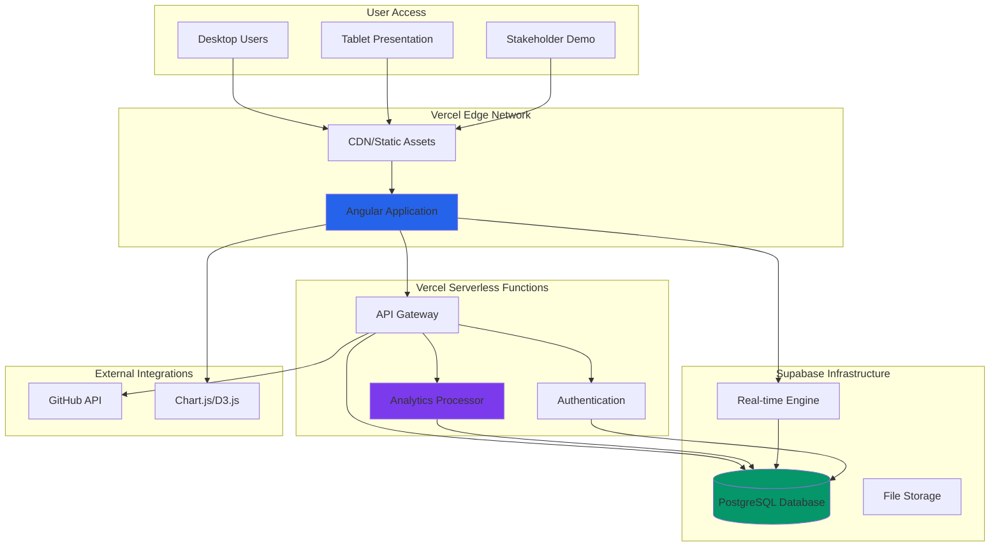
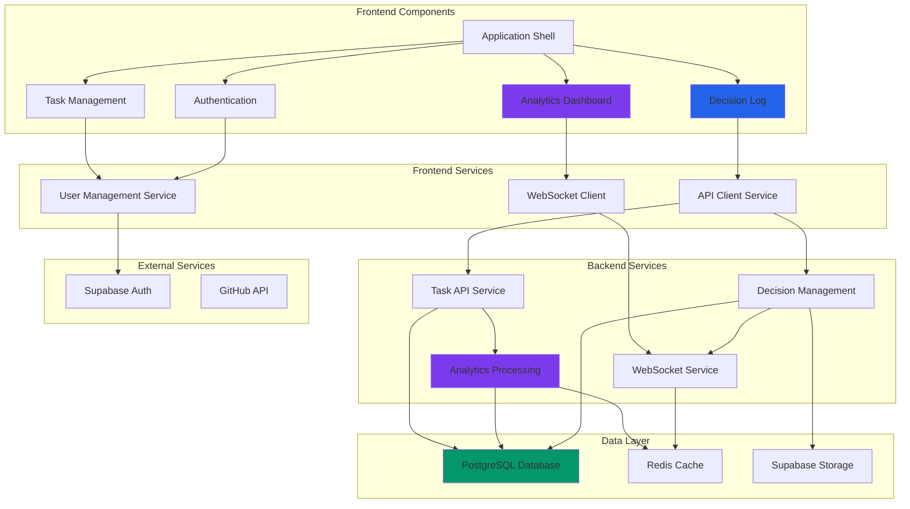
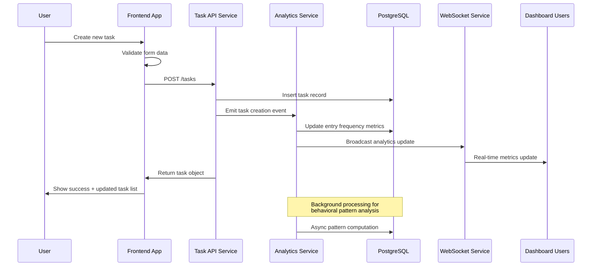
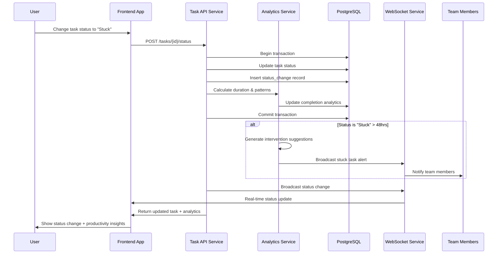
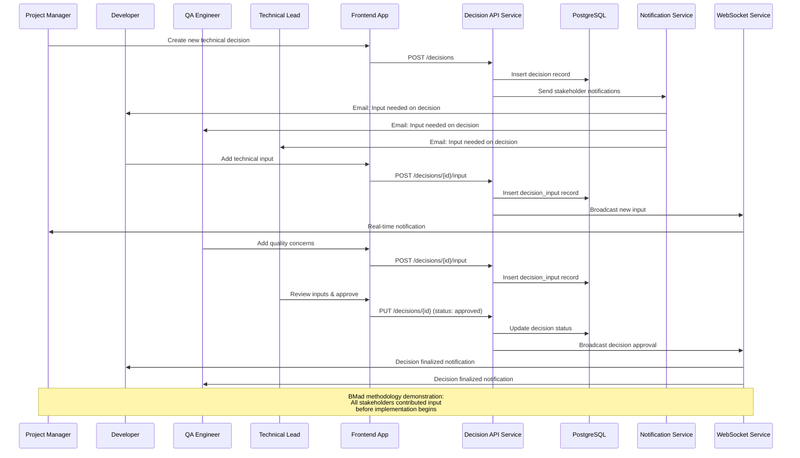
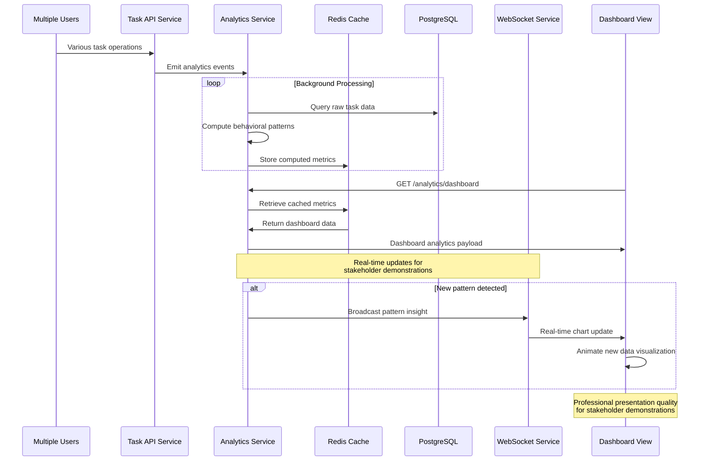
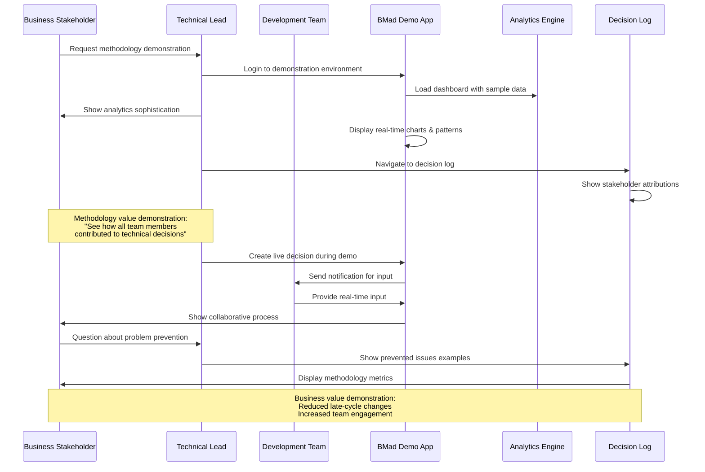
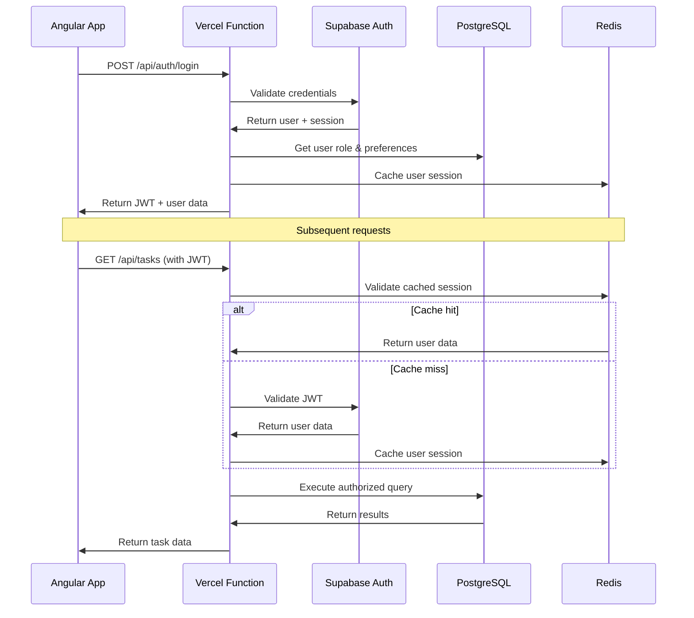

# BMad Demonstration To-Do App Fullstack Architecture Document

## Introduction

This document outlines the complete fullstack architecture for BMad Demonstration To-Do App, including backend systems, frontend implementation, and their integration. It serves as the single source of truth for AI-driven development, ensuring consistency across the entire technology stack.

This unified approach combines what would traditionally be separate backend and frontend architecture documents, streamlining the development process for modern fullstack applications where these concerns are increasingly intertwined.

### Starter Template or Existing Project

**Analysis:** Reviewing the PRD and technical assumptions, this appears to be a **greenfield project** with specific technology stack requirements rather than based on existing templates. The project specifies:
- Angular/Node.js monorepo approach
- PostgreSQL database
- Cloud deployment (AWS/Azure/Google Cloud)
- Professional demonstration requirements

**Recommendation:** While greenfield, I suggest considering the **T3 Stack** or similar **TypeScript fullstack starter** as it aligns perfectly with your requirements:
- Next.js could substitute for Angular (both TypeScript-based)
- tRPC for type-safe APIs
- Prisma for database management
- Built-in authentication patterns

However, given the explicit Angular requirement for showcasing specific technical capabilities, we'll proceed with **custom greenfield setup** to maintain full control over the technology demonstration aspects.

**Decision:** **Greenfield project** - Custom Angular/Node.js/PostgreSQL architecture to meet specific BMad methodology demonstration requirements.

### Change Log

| Date | Version | Description | Author |
|------|---------|-------------|---------|
| 2025-09-15 | 1.0 | Initial fullstack architecture creation | Winston (Architect) |

## High Level Architecture

### Technical Summary

This fullstack architecture implements a **monorepo-based collaborative planning showcase** featuring Angular frontend with Node.js/Express backend services, designed specifically for demonstrating advanced technical capabilities alongside the BMad methodology. The architecture emphasizes **real-time analytics integration** between frontend dashboard visualizations and backend behavioral analysis services, with **PostgreSQL providing robust analytics data management** and JSON flexibility for evolving metrics requirements.

Key integration points include **WebSocket connections for real-time chart updates**, **shared TypeScript interfaces ensuring type safety across the stack**, and **modular service architecture supporting Phase 2 ML extensions**. The system deploys to **cloud infrastructure with CI/CD automation**, positioning the technical implementation as both a functional productivity tool and a **stakeholder demonstration platform** showcasing development team sophistication and collaborative planning effectiveness.

The architecture achieves PRD goals by **balancing sophisticated analytics capabilities** (entry frequency tracking, completion time analysis, behavioral pattern recognition) with **transparent methodology documentation** (decision logs, stakeholder attribution, collaboration metrics), creating a unified system that impresses both technical and business stakeholders while providing meaningful productivity insights.

### Platform and Infrastructure Choice

Based on the PRD requirements and technical assumptions, I'm presenting **three viable platform options** for this BMad demonstration project:

**Option 1: Vercel + Supabase (Recommended)**
- **Pros:** Rapid deployment, built-in analytics, excellent Angular support, managed PostgreSQL, integrated auth
- **Cons:** Vendor lock-in, limited backend customization for advanced analytics
- **Fit:** Excellent for demonstration purposes, professional presentation quality

**Option 2: AWS Full Stack**
- **Pros:** Complete control, enterprise credibility, extensive analytics services (CloudWatch, Kinesis)
- **Cons:** Higher complexity, longer setup time, cost management overhead
- **Fit:** Strong for showcasing enterprise-level technical competency

**Option 3: Google Cloud Platform**
- **Pros:** Strong analytics/ML services for Phase 2, excellent PostgreSQL support, Cloud Run for containers
- **Cons:** Less Angular-specific tooling, steeper learning curve for team
- **Fit:** Best for long-term ML extensions but may be overkill for MVP

**Recommendation: Vercel + Supabase**
This combination provides the optimal balance for the BMad methodology demonstration: professional deployment quality that impresses stakeholders, rapid development velocity that supports collaborative planning timelines, and built-in analytics infrastructure that showcases technical sophistication without overwhelming the 2-3 week MVP timeline.

**Platform:** Vercel + Supabase
**Key Services:** Vercel (Angular hosting, serverless functions), Supabase (PostgreSQL, Auth, Real-time subscriptions), Vercel Analytics (performance monitoring)
**Deployment Host and Regions:** Vercel Edge Network (global), Supabase US-East (primary region for demonstration audiences)

### Repository Structure

For this BMad methodology demonstration, a **monorepo approach using npm workspaces** is the optimal choice:

**Rationale:** The collaborative planning methodology requires transparency and shared decision-making. A monorepo keeps all code, decisions, and artifacts in one location, supporting the BMad principle of visible thinking processes. Additionally, the Angular/Node.js tech stack benefits from shared TypeScript interfaces and unified tooling.

**Structure:** Monorepo with clear package boundaries
**Monorepo Tool:** npm workspaces (lightweight, no additional tooling complexity)
**Package Organization:**
- `apps/web` (Angular frontend)
- `apps/api` (Node.js/Express backend)
- `packages/shared` (TypeScript interfaces, utilities)
- `packages/ui` (shared Angular components)

### High Level Architecture Diagram



### Architectural Patterns

Based on the BMad methodology requirements and technical sophistication goals, these patterns will guide development:

- **Jamstack Architecture:** Static Angular build with serverless API functions - *Rationale:* Optimal performance for stakeholder presentations and scalable analytics processing
- **Component-Based UI:** Reusable Angular components with Angular Material - *Rationale:* Professional presentation quality and maintainable codebase for collaborative development
- **Repository Pattern:** Abstract data access logic with TypeScript interfaces - *Rationale:* Enables testing and supports Phase 2 ML feature extensions
- **Real-time Observer Pattern:** WebSocket subscriptions for live analytics - *Rationale:* Showcases technical sophistication through live dashboard updates
- **Command Query Responsibility Segregation (CQRS):** Separate read/write models for analytics - *Rationale:* Optimizes analytics queries while maintaining transaction integrity
- **API Gateway Pattern:** Centralized routing through Vercel functions - *Rationale:* Unified authentication, rate limiting, and monitoring for demonstration reliability

## Tech Stack

This is the **DEFINITIVE technology selection** for the entire BMad Demonstration To-Do App project. This table serves as the single source of truth - all development must use these exact versions and technologies.

### Technology Stack Table

| Category | Technology | Version | Purpose | Rationale |
|----------|------------|---------|---------|-----------|
| Frontend Language | TypeScript | 5.2+ | Type-safe frontend development | Ensures code quality and enables seamless fullstack type sharing for collaborative development |
| Frontend Framework | Angular | 17+ | Professional SPA framework | Mature enterprise framework showcasing technical sophistication, excellent for stakeholder demonstrations |
| UI Component Library | Angular Material | 17+ | Professional component system | Consistent design language, accessibility compliance, impressive visual quality for presentations |
| State Management | NgRx | 17+ | Predictable state management | Handles complex analytics state and real-time updates, demonstrates advanced Angular patterns |
| Backend Language | Node.js | 20 LTS | JavaScript runtime | Enables fullstack TypeScript consistency, rapid development for collaborative planning timeline |
| Backend Framework | Express.js | 4.18+ | Web application framework | Lightweight, flexible API development with extensive middleware ecosystem |
| API Style | REST with WebSocket | HTTP/1.1 + WS | RESTful APIs + real-time updates | REST for standard CRUD, WebSocket for live analytics showcase and real-time collaboration features |
| Database | PostgreSQL | 15+ | Primary data storage | Robust relational database with JSON support for flexible analytics data and ACID compliance |
| Cache | Redis | 7+ | Session and analytics caching | High-performance caching for analytics queries and session management |
| File Storage | Supabase Storage | Latest | Decision log attachments | Integrated with Supabase ecosystem, handles methodology documentation artifacts |
| Authentication | Supabase Auth | Latest | User authentication system | JWT-based auth with social providers, professional security for stakeholder confidence |
| Frontend Testing | Jest + Testing Library | Latest | Unit and integration testing | Industry standard testing stack ensuring code quality for collaborative development |
| Backend Testing | Jest + Supertest | Latest | API and service testing | Comprehensive backend testing for reliability during stakeholder demonstrations |
| E2E Testing | Playwright | Latest | End-to-end automation | Cross-browser testing ensuring presentation reliability across stakeholder environments |
| Build Tool | Angular CLI | 17+ | Frontend build system | Optimized Angular builds with professional deployment artifacts |
| Bundler | Webpack (via Angular) | Latest | Module bundling | Built into Angular CLI, optimized for production presentations |
| IaC Tool | Vercel CLI | Latest | Infrastructure deployment | Declarative infrastructure supporting rapid collaborative deployment cycles |
| CI/CD | GitHub Actions | Latest | Automated deployment pipeline | Integrated with repository, supports transparent development methodology |
| Monitoring | Vercel Analytics + Sentry | Latest | Performance and error tracking | Professional monitoring showcasing technical sophistication and reliability |
| Logging | Winston | 3.10+ | Structured application logging | Comprehensive audit trail supporting methodology transparency requirements |
| CSS Framework | Tailwind CSS | 3.3+ | Utility-first styling | Rapid UI development supporting collaborative design iteration and professional presentation quality |

## Data Models

Based on the PRD requirements and epics, I'll define the core data models that will be shared between frontend and backend to support the BMad methodology demonstration and advanced analytics features.

### User

**Purpose:** Represents system users participating in the BMad methodology demonstration, supporting role-based collaboration tracking and stakeholder attribution features.

**Key Attributes:**
- id: string (UUID) - Unique user identifier
- email: string - Authentication and communication
- name: string - Display name for stakeholder attribution
- role: UserRole - Collaboration role (Developer, QA, Leadership, Business)
- createdAt: DateTime - Account creation timestamp
- lastLoginAt: DateTime - Activity tracking for engagement metrics
- preferences: UserPreferences - Personalization settings for analytics dashboard

#### TypeScript Interface
```typescript
interface User {
  id: string;
  email: string;
  name: string;
  role: UserRole;
  createdAt: Date;
  lastLoginAt: Date | null;
  preferences: UserPreferences;
}

enum UserRole {
  DEVELOPER = 'developer',
  QA = 'qa',
  LEADERSHIP = 'leadership',
  BUSINESS = 'business',
  PM = 'pm'
}

interface UserPreferences {
  dashboardLayout: 'analytics' | 'tasks' | 'methodology';
  notificationSettings: NotificationSettings;
  analyticsDateRange: number; // days
}
```

#### Relationships
- One-to-many with Task (user creates tasks)
- One-to-many with StatusChange (user changes task status)
- One-to-many with DecisionInput (user contributes to decisions)

### Task

**Purpose:** Core task entity supporting enhanced status tracking, behavioral analytics capture, and productivity measurement for the BMad methodology demonstration.

**Key Attributes:**
- id: string (UUID) - Unique task identifier
- title: string - Task description
- description: string - Detailed task information
- status: TaskStatus - Current task state
- userId: string - Task owner reference
- createdAt: DateTime - Analytics timestamp for entry frequency tracking
- updatedAt: DateTime - Last modification timestamp
- completedAt: DateTime - Completion timestamp for analytics
- estimatedMinutes: number - User estimate for completion time analysis
- actualMinutes: number - Calculated from status changes

#### TypeScript Interface
```typescript
interface Task {
  id: string;
  title: string;
  description: string;
  status: TaskStatus;
  userId: string;
  createdAt: Date;
  updatedAt: Date;
  completedAt: Date | null;
  estimatedMinutes: number | null;
  actualMinutes: number | null;
  tags: string[];
  priority: TaskPriority;
}

enum TaskStatus {
  NOT_STARTED = 'not_started',
  IN_PROGRESS = 'in_progress',
  STUCK = 'stuck',
  COMPLETED = 'completed'
}

enum TaskPriority {
  LOW = 'low',
  MEDIUM = 'medium',
  HIGH = 'high',
  URGENT = 'urgent'
}
```

#### Relationships
- Many-to-one with User (tasks belong to users)
- One-to-many with StatusChange (task status history)
- Many-to-many with Decision (tasks can reference collaborative decisions)

### StatusChange

**Purpose:** Tracks all task status transitions for completion time analytics, behavioral pattern recognition, and productivity measurement supporting the advanced analytics features.

**Key Attributes:**
- id: string (UUID) - Unique change identifier
- taskId: string - Associated task reference
- userId: string - User who made the change
- fromStatus: TaskStatus - Previous status state
- toStatus: TaskStatus - New status state
- changedAt: DateTime - Precise timestamp for analytics
- durationMs: number - Calculated time in previous status
- notes: string - Optional user notes about status change

#### TypeScript Interface
```typescript
interface StatusChange {
  id: string;
  taskId: string;
  userId: string;
  fromStatus: TaskStatus | null;
  toStatus: TaskStatus;
  changedAt: Date;
  durationMs: number | null;
  notes: string | null;
  context: ChangeContext;
}

interface ChangeContext {
  sessionId: string; // For behavioral analytics
  deviceType: 'desktop' | 'tablet' | 'mobile';
  timeOfDay: 'morning' | 'afternoon' | 'evening';
}
```

#### Relationships
- Many-to-one with Task (status changes belong to tasks)
- Many-to-one with User (user makes status changes)

### Decision

**Purpose:** Captures collaborative planning decisions with stakeholder attribution, supporting the BMad methodology demonstration and transparency requirements.

**Key Attributes:**
- id: string (UUID) - Unique decision identifier
- title: string - Decision summary
- description: string - Detailed decision context and rationale
- category: DecisionCategory - Type of decision made
- status: DecisionStatus - Current decision state
- proposedBy: string - User who proposed the decision
- approvedBy: string - User who approved the decision
- createdAt: DateTime - Decision creation timestamp
- approvedAt: DateTime - Decision approval timestamp
- impact: string - Expected impact of the decision
- alternatives: string - Alternative options considered

#### TypeScript Interface
```typescript
interface Decision {
  id: string;
  title: string;
  description: string;
  category: DecisionCategory;
  status: DecisionStatus;
  proposedBy: string;
  approvedBy: string | null;
  createdAt: Date;
  approvedAt: Date | null;
  impact: string;
  alternatives: string | null;
  tags: string[];
}

enum DecisionCategory {
  ARCHITECTURE = 'architecture',
  TECHNOLOGY = 'technology',
  PROCESS = 'process',
  UX_DESIGN = 'ux_design',
  METHODOLOGY = 'methodology'
}

enum DecisionStatus {
  PROPOSED = 'proposed',
  UNDER_DISCUSSION = 'under_discussion',
  APPROVED = 'approved',
  IMPLEMENTED = 'implemented',
  REVISITED = 'revisited'
}
```

#### Relationships
- Many-to-one with User (proposedBy, approvedBy)
- One-to-many with DecisionInput (stakeholder contributions)
- Many-to-many with Task (decisions can reference tasks)

### DecisionInput

**Purpose:** Tracks stakeholder contributions to collaborative decisions, enabling attribution and participation measurement for BMad methodology demonstration.

**Key Attributes:**
- id: string (UUID) - Unique input identifier
- decisionId: string - Associated decision reference
- userId: string - Contributing stakeholder
- inputType: InputType - Type of contribution made
- content: string - Stakeholder input content
- createdAt: DateTime - Contribution timestamp
- agreementLevel: number - Stakeholder agreement score (1-5)

#### TypeScript Interface
```typescript
interface DecisionInput {
  id: string;
  decisionId: string;
  userId: string;
  inputType: InputType;
  content: string;
  createdAt: Date;
  agreementLevel: number; // 1-5 scale
  expertise: ExpertiseArea[];
}

enum InputType {
  SUGGESTION = 'suggestion',
  CONCERN = 'concern',
  APPROVAL = 'approval',
  QUESTION = 'question',
  ALTERNATIVE = 'alternative'
}

enum ExpertiseArea {
  FRONTEND = 'frontend',
  BACKEND = 'backend',
  DATABASE = 'database',
  TESTING = 'testing',
  SECURITY = 'security',
  PERFORMANCE = 'performance',
  UX = 'ux'
}
```

#### Relationships
- Many-to-one with Decision (inputs belong to decisions)
- Many-to-one with User (user provides input)

## API Specification

Based on the chosen REST + WebSocket API style from the tech stack, I'll provide a comprehensive OpenAPI 3.0 specification that covers all endpoints from the PRD epics and supports both standard CRUD operations and real-time analytics features.

### REST API Specification

```yaml
openapi: 3.0.0
info:
  title: BMad Demonstration To-Do App API
  version: 1.0.0
  description: |
    RESTful API for the BMad methodology demonstration application featuring
    task management, behavioral analytics, and collaborative decision tracking.

    Supports real-time updates via WebSocket connections for analytics dashboard
    and collaborative planning features.

servers:
  - url: https://api.bmad-todo-demo.vercel.app
    description: Production API server
  - url: https://api-staging.bmad-todo-demo.vercel.app
    description: Staging API server
  - url: http://localhost:3000
    description: Local development server

paths:
  # Authentication Endpoints
  /auth/login:
    post:
      summary: User authentication
      tags: [Authentication]
      requestBody:
        required: true
        content:
          application/json:
            schema:
              type: object
              properties:
                email:
                  type: string
                  format: email
                password:
                  type: string
                  minLength: 8
              required: [email, password]
      responses:
        '200':
          description: Successful authentication
          content:
            application/json:
              schema:
                type: object
                properties:
                  user:
                    $ref: '#/components/schemas/User'
                  accessToken:
                    type: string
                  refreshToken:
                    type: string
        '401':
          $ref: '#/components/responses/Unauthorized'

  /auth/register:
    post:
      summary: User registration
      tags: [Authentication]
      requestBody:
        required: true
        content:
          application/json:
            schema:
              type: object
              properties:
                email:
                  type: string
                  format: email
                password:
                  type: string
                  minLength: 8
                name:
                  type: string
                role:
                  $ref: '#/components/schemas/UserRole'
              required: [email, password, name, role]
      responses:
        '201':
          description: User created successfully
          content:
            application/json:
              schema:
                $ref: '#/components/schemas/User'

  # Task Management Endpoints
  /tasks:
    get:
      summary: List user tasks with filtering
      tags: [Tasks]
      security:
        - bearerAuth: []
      parameters:
        - name: status
          in: query
          schema:
            $ref: '#/components/schemas/TaskStatus'
        - name: limit
          in: query
          schema:
            type: integer
            default: 50
        - name: offset
          in: query
          schema:
            type: integer
            default: 0
      responses:
        '200':
          description: List of tasks
          content:
            application/json:
              schema:
                type: object
                properties:
                  tasks:
                    type: array
                    items:
                      $ref: '#/components/schemas/Task'
                  total:
                    type: integer
                  limit:
                    type: integer
                  offset:
                    type: integer

    post:
      summary: Create new task
      tags: [Tasks]
      security:
        - bearerAuth: []
      requestBody:
        required: true
        content:
          application/json:
            schema:
              type: object
              properties:
                title:
                  type: string
                  maxLength: 200
                description:
                  type: string
                  maxLength: 1000
                estimatedMinutes:
                  type: integer
                  minimum: 1
                priority:
                  $ref: '#/components/schemas/TaskPriority'
                tags:
                  type: array
                  items:
                    type: string
              required: [title]
      responses:
        '201':
          description: Task created successfully
          content:
            application/json:
              schema:
                $ref: '#/components/schemas/Task'

  /tasks/{taskId}:
    get:
      summary: Get task details
      tags: [Tasks]
      security:
        - bearerAuth: []
      parameters:
        - name: taskId
          in: path
          required: true
          schema:
            type: string
            format: uuid
      responses:
        '200':
          description: Task details
          content:
            application/json:
              schema:
                $ref: '#/components/schemas/Task'

    put:
      summary: Update task
      tags: [Tasks]
      security:
        - bearerAuth: []
      parameters:
        - name: taskId
          in: path
          required: true
          schema:
            type: string
            format: uuid
      requestBody:
        required: true
        content:
          application/json:
            schema:
              type: object
              properties:
                title:
                  type: string
                description:
                  type: string
                estimatedMinutes:
                  type: integer
                priority:
                  $ref: '#/components/schemas/TaskPriority'
                tags:
                  type: array
                  items:
                    type: string
      responses:
        '200':
          description: Task updated successfully
          content:
            application/json:
              schema:
                $ref: '#/components/schemas/Task'

    delete:
      summary: Delete task
      tags: [Tasks]
      security:
        - bearerAuth: []
      parameters:
        - name: taskId
          in: path
          required: true
          schema:
            type: string
            format: uuid
      responses:
        '204':
          description: Task deleted successfully

  /tasks/{taskId}/status:
    post:
      summary: Change task status (triggers analytics capture)
      tags: [Tasks]
      security:
        - bearerAuth: []
      parameters:
        - name: taskId
          in: path
          required: true
          schema:
            type: string
            format: uuid
      requestBody:
        required: true
        content:
          application/json:
            schema:
              type: object
              properties:
                status:
                  $ref: '#/components/schemas/TaskStatus'
                notes:
                  type: string
                context:
                  type: object
                  properties:
                    deviceType:
                      type: string
                      enum: [desktop, tablet, mobile]
                    timeOfDay:
                      type: string
                      enum: [morning, afternoon, evening]
              required: [status]
      responses:
        '200':
          description: Status updated successfully
          content:
            application/json:
              schema:
                type: object
                properties:
                  task:
                    $ref: '#/components/schemas/Task'
                  statusChange:
                    $ref: '#/components/schemas/StatusChange'

  # Analytics Endpoints
  /analytics/dashboard:
    get:
      summary: Get dashboard analytics summary
      tags: [Analytics]
      security:
        - bearerAuth: []
      parameters:
        - name: dateRange
          in: query
          schema:
            type: integer
            default: 30
            description: Number of days to include
      responses:
        '200':
          description: Dashboard analytics data
          content:
            application/json:
              schema:
                type: object
                properties:
                  taskStats:
                    type: object
                    properties:
                      total:
                        type: integer
                      completed:
                        type: integer
                      inProgress:
                        type: integer
                      stuck:
                        type: integer
                  entryFrequency:
                    type: array
                    items:
                      type: object
                      properties:
                        date:
                          type: string
                          format: date
                        count:
                          type: integer
                  completionTimes:
                    type: object
                    properties:
                      average:
                        type: number
                      median:
                        type: number
                      distribution:
                        type: array
                        items:
                          type: object
                          properties:
                            range:
                              type: string
                            count:
                              type: integer

  /analytics/behavioral-patterns:
    get:
      summary: Get behavioral pattern analysis
      tags: [Analytics]
      security:
        - bearerAuth: []
      responses:
        '200':
          description: Behavioral pattern insights
          content:
            application/json:
              schema:
                type: object
                properties:
                  peakTimes:
                    type: array
                    items:
                      type: object
                      properties:
                        hour:
                          type: integer
                        activity:
                          type: number
                  stuckPatterns:
                    type: array
                    items:
                      type: object
                      properties:
                        pattern:
                          type: string
                        frequency:
                          type: integer
                  productivityTrends:
                    type: array
                    items:
                      type: object
                      properties:
                        period:
                          type: string
                        efficiency:
                          type: number

  # Decision Log Endpoints
  /decisions:
    get:
      summary: List collaborative decisions
      tags: [Decisions]
      security:
        - bearerAuth: []
      parameters:
        - name: category
          in: query
          schema:
            $ref: '#/components/schemas/DecisionCategory'
        - name: status
          in: query
          schema:
            $ref: '#/components/schemas/DecisionStatus'
      responses:
        '200':
          description: List of decisions
          content:
            application/json:
              schema:
                type: array
                items:
                  $ref: '#/components/schemas/Decision'

    post:
      summary: Create new decision
      tags: [Decisions]
      security:
        - bearerAuth: []
      requestBody:
        required: true
        content:
          application/json:
            schema:
              type: object
              properties:
                title:
                  type: string
                description:
                  type: string
                category:
                  $ref: '#/components/schemas/DecisionCategory'
                impact:
                  type: string
                alternatives:
                  type: string
                tags:
                  type: array
                  items:
                    type: string
              required: [title, description, category]
      responses:
        '201':
          description: Decision created successfully
          content:
            application/json:
              schema:
                $ref: '#/components/schemas/Decision'

  /decisions/{decisionId}/input:
    post:
      summary: Add stakeholder input to decision
      tags: [Decisions]
      security:
        - bearerAuth: []
      parameters:
        - name: decisionId
          in: path
          required: true
          schema:
            type: string
            format: uuid
      requestBody:
        required: true
        content:
          application/json:
            schema:
              type: object
              properties:
                inputType:
                  $ref: '#/components/schemas/InputType'
                content:
                  type: string
                agreementLevel:
                  type: integer
                  minimum: 1
                  maximum: 5
                expertise:
                  type: array
                  items:
                    $ref: '#/components/schemas/ExpertiseArea'
              required: [inputType, content, agreementLevel]
      responses:
        '201':
          description: Input added successfully
          content:
            application/json:
              schema:
                $ref: '#/components/schemas/DecisionInput'

components:
  securitySchemes:
    bearerAuth:
      type: http
      scheme: bearer
      bearerFormat: JWT

  schemas:
    User:
      type: object
      properties:
        id:
          type: string
          format: uuid
        email:
          type: string
          format: email
        name:
          type: string
        role:
          $ref: '#/components/schemas/UserRole'
        createdAt:
          type: string
          format: date-time
        lastLoginAt:
          type: string
          format: date-time

    UserRole:
      type: string
      enum: [developer, qa, leadership, business, pm]

    Task:
      type: object
      properties:
        id:
          type: string
          format: uuid
        title:
          type: string
        description:
          type: string
        status:
          $ref: '#/components/schemas/TaskStatus'
        userId:
          type: string
          format: uuid
        createdAt:
          type: string
          format: date-time
        updatedAt:
          type: string
          format: date-time
        completedAt:
          type: string
          format: date-time
          nullable: true
        estimatedMinutes:
          type: integer
          nullable: true
        actualMinutes:
          type: integer
          nullable: true
        priority:
          $ref: '#/components/schemas/TaskPriority'
        tags:
          type: array
          items:
            type: string

    TaskStatus:
      type: string
      enum: [not_started, in_progress, stuck, completed]

    TaskPriority:
      type: string
      enum: [low, medium, high, urgent]

    StatusChange:
      type: object
      properties:
        id:
          type: string
          format: uuid
        taskId:
          type: string
          format: uuid
        userId:
          type: string
          format: uuid
        fromStatus:
          $ref: '#/components/schemas/TaskStatus'
          nullable: true
        toStatus:
          $ref: '#/components/schemas/TaskStatus'
        changedAt:
          type: string
          format: date-time
        durationMs:
          type: integer
          nullable: true
        notes:
          type: string
          nullable: true

    Decision:
      type: object
      properties:
        id:
          type: string
          format: uuid
        title:
          type: string
        description:
          type: string
        category:
          $ref: '#/components/schemas/DecisionCategory'
        status:
          $ref: '#/components/schemas/DecisionStatus'
        proposedBy:
          type: string
          format: uuid
        approvedBy:
          type: string
          format: uuid
          nullable: true
        createdAt:
          type: string
          format: date-time
        approvedAt:
          type: string
          format: date-time
          nullable: true
        impact:
          type: string
        alternatives:
          type: string
          nullable: true
        tags:
          type: array
          items:
            type: string

    DecisionCategory:
      type: string
      enum: [architecture, technology, process, ux_design, methodology]

    DecisionStatus:
      type: string
      enum: [proposed, under_discussion, approved, implemented, revisited]

    DecisionInput:
      type: object
      properties:
        id:
          type: string
          format: uuid
        decisionId:
          type: string
          format: uuid
        userId:
          type: string
          format: uuid
        inputType:
          $ref: '#/components/schemas/InputType'
        content:
          type: string
        createdAt:
          type: string
          format: date-time
        agreementLevel:
          type: integer
          minimum: 1
          maximum: 5
        expertise:
          type: array
          items:
            $ref: '#/components/schemas/ExpertiseArea'

    InputType:
      type: string
      enum: [suggestion, concern, approval, question, alternative]

    ExpertiseArea:
      type: string
      enum: [frontend, backend, database, testing, security, performance, ux]

  responses:
    Unauthorized:
      description: Authentication required
      content:
        application/json:
          schema:
            type: object
            properties:
              error:
                type: object
                properties:
                  code:
                    type: string
                    example: "UNAUTHORIZED"
                  message:
                    type: string
                    example: "Authentication required"
                  timestamp:
                    type: string
                    format: date-time
                  requestId:
                    type: string
                    format: uuid
```

## Components

Based on the architectural patterns, tech stack, and data models defined above, I'll identify the major logical components/services across the fullstack that support both the task management functionality and BMad methodology demonstration requirements.

### Frontend Application Shell

**Responsibility:** Main Angular application container providing routing, authentication state management, and shared UI components for the BMad methodology demonstration interface.

**Key Interfaces:**
- Authentication service integration for user session management
- Global state management via NgRx for real-time analytics updates
- Responsive layout system supporting desktop and tablet presentation modes
- Navigation service providing context-aware routing for demonstration flows

**Dependencies:** Angular Router, NgRx Store, Angular Material, Authentication Service

**Technology Stack:** Angular 17+, NgRx, Angular Material, Tailwind CSS for professional stakeholder presentation quality

### Task Management Component

**Responsibility:** Comprehensive CRUD operations for tasks with enhanced status tracking, supporting both daily productivity use and behavioral analytics data capture.

**Key Interfaces:**
- Task API service for all CRUD operations and status changes
- Real-time status update notifications via WebSocket connections
- Analytics event emission for behavioral pattern tracking
- Bulk operations interface for efficient task management

**Dependencies:** Task API Service, WebSocket Service, Analytics Tracking Service

**Technology Stack:** Angular reactive forms, NgRx for state management, Angular Material components

### Analytics Dashboard Component

**Responsibility:** Real-time data visualization showcasing advanced technical capabilities through interactive charts, behavioral pattern displays, and productivity insights.

**Key Interfaces:**
- Analytics API service for dashboard data retrieval
- Chart rendering engine (Chart.js/D3.js) for professional visualizations
- Real-time data subscription service for live updates during demonstrations
- Export service for analytics data and chart images

**Dependencies:** Analytics API Service, Chart.js, WebSocket Service, Export Service

**Technology Stack:** Chart.js for consistent professional charts, NgRx for real-time state updates, Angular CDK for advanced UI patterns

### Decision Log Component

**Responsibility:** Collaborative decision documentation and stakeholder attribution interface, core to BMad methodology demonstration and transparency requirements.

**Key Interfaces:**
- Decision API service for CRUD operations and stakeholder input
- Collaborative input interface supporting threaded discussions
- Attribution display system showing stakeholder contributions
- Search and filtering service for decision archive management

**Dependencies:** Decision API Service, User Management Service, Notification Service

**Technology Stack:** Angular reactive forms, rich text editor for decision documentation, Angular Material for professional stakeholder presentation

### User Management Service

**Responsibility:** Authentication, authorization, and user profile management supporting role-based collaboration tracking and stakeholder attribution.

**Key Interfaces:**
- Supabase Auth integration for JWT token management
- Role-based permission system for collaboration features
- User preference management for dashboard customization
- Session management with automatic token refresh

**Dependencies:** Supabase Auth, JWT handling libraries, HTTP interceptors

**Technology Stack:** Supabase SDK, Angular HTTP interceptors, NgRx for authentication state

### Task API Service

**Responsibility:** Backend service providing task CRUD operations, status change tracking, and analytics data capture supporting both productivity features and behavioral analysis.

**Key Interfaces:**
- RESTful endpoints for standard task operations
- Status change endpoint with analytics context capture
- Bulk operations support for efficient data management
- Real-time event emission for WebSocket updates

**Dependencies:** PostgreSQL database, Express.js routing, Analytics Processing Service

**Technology Stack:** Node.js, Express.js, PostgreSQL with JSON analytics columns, Winston logging

### Analytics Processing Service

**Responsibility:** Background analytics computation, behavioral pattern recognition, and productivity insights generation showcasing advanced technical capabilities.

**Key Interfaces:**
- Task event processing for completion time analysis
- Behavioral pattern detection algorithms
- Dashboard data aggregation with caching optimization
- Real-time analytics update broadcasting via WebSocket

**Dependencies:** Task database, Redis caching, WebSocket service

**Technology Stack:** Node.js background workers, Redis for caching, PostgreSQL for analytics queries, statistical analysis libraries

### Decision Management Service

**Responsibility:** Collaborative decision logging, stakeholder input tracking, and methodology artifact generation supporting BMad demonstration transparency.

**Key Interfaces:**
- Decision CRUD operations with approval workflow
- Stakeholder input collection and attribution
- Decision search and categorization services
- Methodology metrics calculation for BMad effectiveness measurement

**Dependencies:** PostgreSQL database, User Management Service, Notification Service

**Technology Stack:** Node.js, Express.js, PostgreSQL with full-text search, email notification integration

### WebSocket Service

**Responsibility:** Real-time communication between frontend and backend enabling live analytics updates and collaborative planning notifications.

**Key Interfaces:**
- Real-time analytics data broadcasting for dashboard updates
- Collaborative decision notification system
- Task status change notifications for team coordination
- Connection management with authentication and reconnection logic

**Dependencies:** Authentication Service, Analytics Processing Service, Decision Management Service

**Technology Stack:** Socket.io for WebSocket management, Redis for scalable pub/sub messaging, JWT authentication integration

### Database Service

**Responsibility:** Data persistence, query optimization, and analytics data management supporting both transactional operations and complex analytics queries.

**Key Interfaces:**
- Task and user data persistence with ACID compliance
- Analytics query optimization for sub-100ms response times
- Decision log storage with full-text search capabilities
- Database migration and backup management

**Dependencies:** PostgreSQL database, connection pooling, migration tools

**Technology Stack:** PostgreSQL 15+, connection pooling (pg-pool), database migrations (Knex.js), JSON analytics columns

### Component Diagrams



## External APIs

Based on the PRD requirements and component design, I've analyzed the external API integrations needed. The BMad demonstration application requires minimal external dependencies to maintain focus on methodology demonstration and technical showcase objectives.

### GitHub API

- **Purpose:** Repository integration for transparent development methodology demonstration and commit/PR activity tracking in decision logs
- **Documentation:** https://docs.github.com/en/rest
- **Base URL(s):** https://api.github.com
- **Authentication:** Personal Access Token (PAT) or GitHub App authentication
- **Rate Limits:** 5,000 requests per hour (authenticated), 60 requests per hour (unauthenticated)

**Key Endpoints Used:**
- `GET /repos/{owner}/{repo}/commits` - Display recent development activity in methodology dashboard
- `GET /repos/{owner}/{repo}/pulls` - Show collaborative PR review process as part of BMad demonstration
- `GET /repos/{owner}/{repo}/issues` - Link decision log entries to specific GitHub issues/discussions

**Integration Notes:** Optional integration for enhanced methodology demonstration. Primary use is showing transparent development process and linking decision log entries to actual development artifacts. Rate limiting requires caching and strategic API usage during stakeholder presentations.

### Supabase Real-time API

- **Purpose:** WebSocket-based real-time database subscriptions for live analytics updates and collaborative decision notifications
- **Documentation:** https://supabase.com/docs/guides/realtime
- **Base URL(s):** wss://{project-id}.supabase.co/realtime/v1/websocket
- **Authentication:** JWT token-based authentication integrated with Supabase Auth
- **Rate Limits:** Connection-based limits, typically 100 concurrent connections per project

**Key Endpoints Used:**
- `WebSocket /realtime/v1/websocket` - Real-time database change subscriptions
- Database table subscriptions for `tasks`, `status_changes`, `decisions`, `decision_inputs`

**Integration Notes:** Core to the real-time analytics demonstration. Enables live dashboard updates during stakeholder presentations. Essential for showcasing technical sophistication through real-time collaborative features.

### Chart.js/D3.js (Client-side Libraries)

- **Purpose:** Professional data visualization for analytics dashboard showcasing advanced technical capabilities
- **Documentation:** https://www.chartjs.org/docs/, https://d3js.org/
- **Base URL(s):** CDN or npm package integration
- **Authentication:** Not applicable (client-side libraries)
- **Rate Limits:** Not applicable

**Key Endpoints Used:**
- Chart.js: Various chart type configurations for analytics dashboard
- D3.js: Custom behavioral pattern visualizations for advanced analytics showcase

**Integration Notes:** Primary visualization engine for stakeholder demonstrations. Chart.js provides professional, consistent charts while D3.js enables custom visualizations for sophisticated behavioral analytics. Critical for impressing technical and business stakeholders.

## Core Workflows

I'll illustrate the key system workflows using sequence diagrams that show both the technical architecture in action and the BMad methodology demonstration value. These workflows represent critical user journeys from the PRD that showcase collaborative planning benefits.

### Task Creation with Analytics Capture Workflow



### Enhanced Status Change with Real-time Analytics



### Collaborative Decision Creation Workflow



### Real-time Analytics Dashboard Update Workflow



### End-to-End BMad Methodology Demonstration Workflow



## Database Schema

Transforming the conceptual data models into a concrete PostgreSQL schema optimized for both transactional task management and complex analytics queries. The schema supports the BMad methodology demonstration requirements while ensuring sub-100ms analytics performance.

```sql
-- Enable UUID extension for primary keys
CREATE EXTENSION IF NOT EXISTS "uuid-ossp";

-- Enable full-text search for decision logs
CREATE EXTENSION IF NOT EXISTS "pg_trgm";

-- Users table with role-based collaboration tracking
CREATE TABLE users (
    id UUID PRIMARY KEY DEFAULT uuid_generate_v4(),
    email VARCHAR(255) UNIQUE NOT NULL,
    name VARCHAR(255) NOT NULL,
    role VARCHAR(50) NOT NULL CHECK (role IN ('developer', 'qa', 'leadership', 'business', 'pm')),
    created_at TIMESTAMP WITH TIME ZONE DEFAULT NOW(),
    last_login_at TIMESTAMP WITH TIME ZONE,
    preferences JSONB DEFAULT '{}',

    -- Indexes for authentication and collaboration queries
    CONSTRAINT users_email_check CHECK (email ~* '^[A-Za-z0-9._%+-]+@[A-Za-z0-9.-]+\.[A-Za-z]{2,}$')
);

CREATE INDEX idx_users_email ON users(email);
CREATE INDEX idx_users_role ON users(role);
CREATE INDEX idx_users_last_login ON users(last_login_at);

-- Tasks table with enhanced status tracking and analytics support
CREATE TABLE tasks (
    id UUID PRIMARY KEY DEFAULT uuid_generate_v4(),
    title VARCHAR(200) NOT NULL,
    description TEXT,
    status VARCHAR(50) NOT NULL DEFAULT 'not_started'
        CHECK (status IN ('not_started', 'in_progress', 'stuck', 'completed')),
    priority VARCHAR(20) NOT NULL DEFAULT 'medium'
        CHECK (priority IN ('low', 'medium', 'high', 'urgent')),
    user_id UUID NOT NULL REFERENCES users(id) ON DELETE CASCADE,
    created_at TIMESTAMP WITH TIME ZONE DEFAULT NOW(),
    updated_at TIMESTAMP WITH TIME ZONE DEFAULT NOW(),
    completed_at TIMESTAMP WITH TIME ZONE,
    estimated_minutes INTEGER CHECK (estimated_minutes > 0),
    actual_minutes INTEGER CHECK (actual_minutes > 0),
    tags TEXT[] DEFAULT '{}',

    -- Analytics optimization
    analytics_context JSONB DEFAULT '{}',

    -- Constraints
    CONSTRAINT tasks_completion_logic CHECK (
        (status = 'completed' AND completed_at IS NOT NULL) OR
        (status != 'completed' AND completed_at IS NULL)
    )
);

-- Indexes for task queries and analytics
CREATE INDEX idx_tasks_user_status ON tasks(user_id, status);
CREATE INDEX idx_tasks_created_at ON tasks(created_at);
CREATE INDEX idx_tasks_status_updated ON tasks(status, updated_at);
CREATE INDEX idx_tasks_completed_at ON tasks(completed_at) WHERE completed_at IS NOT NULL;
CREATE INDEX idx_tasks_analytics_context ON tasks USING GIN(analytics_context);
CREATE INDEX idx_tasks_tags ON tasks USING GIN(tags);

-- Status changes for completion time analytics and behavioral patterns
CREATE TABLE status_changes (
    id UUID PRIMARY KEY DEFAULT uuid_generate_v4(),
    task_id UUID NOT NULL REFERENCES tasks(id) ON DELETE CASCADE,
    user_id UUID NOT NULL REFERENCES users(id) ON DELETE CASCADE,
    from_status VARCHAR(50) CHECK (from_status IN ('not_started', 'in_progress', 'stuck', 'completed')),
    to_status VARCHAR(50) NOT NULL CHECK (to_status IN ('not_started', 'in_progress', 'stuck', 'completed')),
    changed_at TIMESTAMP WITH TIME ZONE DEFAULT NOW(),
    duration_ms BIGINT CHECK (duration_ms >= 0),
    notes TEXT,
    context JSONB DEFAULT '{}',

    -- Prevent invalid status transitions
    CONSTRAINT status_changes_transition_check CHECK (from_status != to_status)
);

-- Indexes for analytics queries
CREATE INDEX idx_status_changes_task_time ON status_changes(task_id, changed_at);
CREATE INDEX idx_status_changes_user_time ON status_changes(user_id, changed_at);
CREATE INDEX idx_status_changes_duration ON status_changes(duration_ms) WHERE duration_ms IS NOT NULL;
CREATE INDEX idx_status_changes_to_status ON status_changes(to_status, changed_at);
CREATE INDEX idx_status_changes_context ON status_changes USING GIN(context);

-- Decisions table for collaborative planning demonstration
CREATE TABLE decisions (
    id UUID PRIMARY KEY DEFAULT uuid_generate_v4(),
    title VARCHAR(255) NOT NULL,
    description TEXT NOT NULL,
    category VARCHAR(50) NOT NULL CHECK (category IN ('architecture', 'technology', 'process', 'ux_design', 'methodology')),
    status VARCHAR(50) NOT NULL DEFAULT 'proposed'
        CHECK (status IN ('proposed', 'under_discussion', 'approved', 'implemented', 'revisited')),
    proposed_by UUID NOT NULL REFERENCES users(id),
    approved_by UUID REFERENCES users(id),
    created_at TIMESTAMP WITH TIME ZONE DEFAULT NOW(),
    approved_at TIMESTAMP WITH TIME ZONE,
    impact TEXT,
    alternatives TEXT,
    tags TEXT[] DEFAULT '{}',

    -- Full-text search support
    search_vector tsvector,

    -- Methodology tracking
    methodology_metrics JSONB DEFAULT '{}',

    CONSTRAINT decisions_approval_logic CHECK (
        (status IN ('approved', 'implemented') AND approved_by IS NOT NULL AND approved_at IS NOT NULL) OR
        (status NOT IN ('approved', 'implemented'))
    )
);

-- Indexes for decision queries and search
CREATE INDEX idx_decisions_category_status ON decisions(category, status);
CREATE INDEX idx_decisions_proposed_by ON decisions(proposed_by, created_at);
CREATE INDEX idx_decisions_approved_by ON decisions(approved_by, approved_at);
CREATE INDEX idx_decisions_search ON decisions USING GIN(search_vector);
CREATE INDEX idx_decisions_tags ON decisions USING GIN(tags);
CREATE INDEX idx_decisions_created_at ON decisions(created_at);

-- Decision inputs for stakeholder attribution
CREATE TABLE decision_inputs (
    id UUID PRIMARY KEY DEFAULT uuid_generate_v4(),
    decision_id UUID NOT NULL REFERENCES decisions(id) ON DELETE CASCADE,
    user_id UUID NOT NULL REFERENCES users(id) ON DELETE CASCADE,
    input_type VARCHAR(50) NOT NULL CHECK (input_type IN ('suggestion', 'concern', 'approval', 'question', 'alternative')),
    content TEXT NOT NULL,
    created_at TIMESTAMP WITH TIME ZONE DEFAULT NOW(),
    agreement_level INTEGER CHECK (agreement_level >= 1 AND agreement_level <= 5),
    expertise_areas TEXT[] DEFAULT '{}' CHECK (
        expertise_areas <@ ARRAY['frontend', 'backend', 'database', 'testing', 'security', 'performance', 'ux']
    ),

    -- Prevent duplicate inputs from same user
    UNIQUE(decision_id, user_id, input_type, created_at)
);

-- Indexes for stakeholder attribution queries
CREATE INDEX idx_decision_inputs_decision_time ON decision_inputs(decision_id, created_at);
CREATE INDEX idx_decision_inputs_user_type ON decision_inputs(user_id, input_type);
CREATE INDEX idx_decision_inputs_agreement ON decision_inputs(agreement_level, created_at);

-- Analytics summary table for dashboard performance
CREATE TABLE analytics_summaries (
    id UUID PRIMARY KEY DEFAULT uuid_generate_v4(),
    user_id UUID REFERENCES users(id) ON DELETE CASCADE,
    date_range_start DATE NOT NULL,
    date_range_end DATE NOT NULL,
    summary_type VARCHAR(50) NOT NULL CHECK (summary_type IN ('daily', 'weekly', 'monthly')),
    metrics JSONB NOT NULL,
    computed_at TIMESTAMP WITH TIME ZONE DEFAULT NOW(),

    -- Prevent duplicate summaries
    UNIQUE(user_id, date_range_start, date_range_end, summary_type)
);

CREATE INDEX idx_analytics_summaries_user_date ON analytics_summaries(user_id, date_range_start, date_range_end);
CREATE INDEX idx_analytics_summaries_type ON analytics_summaries(summary_type, computed_at);

-- Trigger to update search vector for decisions
CREATE OR REPLACE FUNCTION update_decision_search_vector()
RETURNS TRIGGER AS $$
BEGIN
    NEW.search_vector := to_tsvector('english',
        COALESCE(NEW.title, '') || ' ' ||
        COALESCE(NEW.description, '') || ' ' ||
        COALESCE(NEW.impact, '') || ' ' ||
        COALESCE(NEW.alternatives, '')
    );
    RETURN NEW;
END;
$$ LANGUAGE plpgsql;

CREATE TRIGGER decision_search_update
    BEFORE INSERT OR UPDATE ON decisions
    FOR EACH ROW EXECUTE FUNCTION update_decision_search_vector();

-- Trigger to automatically update task updated_at
CREATE OR REPLACE FUNCTION update_task_updated_at()
RETURNS TRIGGER AS $$
BEGIN
    NEW.updated_at = NOW();
    RETURN NEW;
END;
$$ LANGUAGE plpgsql;

CREATE TRIGGER task_updated_at_trigger
    BEFORE UPDATE ON tasks
    FOR EACH ROW EXECUTE FUNCTION update_task_updated_at();

-- Function to calculate actual minutes from status changes
CREATE OR REPLACE FUNCTION calculate_task_duration(task_uuid UUID)
RETURNS INTEGER AS $$
DECLARE
    total_minutes INTEGER := 0;
    duration_sum BIGINT;
BEGIN
    -- Sum all durations where task moved to 'completed' status
    SELECT COALESCE(SUM(duration_ms), 0) INTO duration_sum
    FROM status_changes
    WHERE task_id = task_uuid
    AND to_status = 'completed';

    -- Convert milliseconds to minutes
    total_minutes := ROUND(duration_sum / 60000.0);

    RETURN total_minutes;
END;
$$ LANGUAGE plpgsql;

-- View for analytics dashboard queries
CREATE VIEW task_analytics AS
SELECT
    t.id,
    t.user_id,
    t.status,
    t.priority,
    t.created_at,
    t.completed_at,
    t.estimated_minutes,
    calculate_task_duration(t.id) as actual_minutes,
    EXTRACT(epoch FROM (t.completed_at - t.created_at)) / 60 as total_minutes,
    EXTRACT(hour FROM t.created_at) as creation_hour,
    EXTRACT(dow FROM t.created_at) as creation_day_of_week,
    CASE
        WHEN t.completed_at IS NOT NULL THEN
            EXTRACT(epoch FROM (t.completed_at - t.created_at)) / 60
        ELSE NULL
    END as completion_time_minutes
FROM tasks t;

-- View for collaboration metrics
CREATE VIEW collaboration_metrics AS
SELECT
    d.id as decision_id,
    d.category,
    d.status,
    d.created_at,
    d.approved_at,
    COUNT(di.id) as input_count,
    COUNT(DISTINCT di.user_id) as contributor_count,
    COUNT(DISTINCT u.role) as role_diversity,
    AVG(di.agreement_level) as avg_agreement,
    EXTRACT(epoch FROM (d.approved_at - d.created_at)) / 3600 as decision_time_hours
FROM decisions d
LEFT JOIN decision_inputs di ON d.id = di.decision_id
LEFT JOIN users u ON di.user_id = u.id
GROUP BY d.id, d.category, d.status, d.created_at, d.approved_at;

-- Performance optimization: Partial indexes for common queries
CREATE INDEX idx_tasks_active ON tasks(user_id, created_at)
    WHERE status IN ('not_started', 'in_progress', 'stuck');

CREATE INDEX idx_decisions_active ON decisions(category, created_at)
    WHERE status IN ('proposed', 'under_discussion');

-- Row-level security (RLS) for multi-tenant data isolation
ALTER TABLE tasks ENABLE ROW LEVEL SECURITY;
ALTER TABLE status_changes ENABLE ROW LEVEL SECURITY;
ALTER TABLE decision_inputs ENABLE ROW LEVEL SECURITY;

-- RLS policies (example - would be expanded based on auth requirements)
CREATE POLICY user_tasks_policy ON tasks
    FOR ALL USING (user_id = current_setting('app.current_user_id')::UUID);
```

## Frontend Architecture

Defining the Angular-specific architecture details that support both sophisticated task management functionality and professional stakeholder demonstration requirements. The frontend architecture emphasizes real-time analytics capabilities and collaborative planning visualization.

### Component Architecture

#### Component Organization

```text
src/
├── app/
│   ├── core/                           # Singleton services and guards
│   │   ├── auth/
│   │   ├── guards/
│   │   └── interceptors/
│   ├── shared/                         # Reusable components and utilities
│   │   ├── components/
│   │   ├── directives/
│   │   ├── pipes/
│   │   └── models/
│   ├── features/                       # Feature modules
│   │   ├── dashboard/
│   │   │   ├── components/
│   │   │   ├── services/
│   │   │   └── dashboard.module.ts
│   │   ├── tasks/
│   │   │   ├── components/
│   │   │   ├── services/
│   │   │   └── tasks.module.ts
│   │   ├── analytics/
│   │   │   ├── components/
│   │   │   ├── services/
│   │   │   └── analytics.module.ts
│   │   ├── decisions/
│   │   │   ├── components/
│   │   │   ├── services/
│   │   │   └── decisions.module.ts
│   │   └── methodology/
│   │       ├── components/
│   │       ├── services/
│   │       └── methodology.module.ts
│   ├── layout/                         # Shell components
│   │   ├── header/
│   │   ├── sidebar/
│   │   └── footer/
│   └── store/                          # NgRx state management
│       ├── actions/
│       ├── effects/
│       ├── reducers/
│       └── selectors/
```

#### Component Template

```typescript
// Feature component following Angular best practices
@Component({
  selector: 'app-analytics-dashboard',
  template: `
    <div class="analytics-dashboard" [class.demo-mode]="isDemoMode">
      <mat-card class="dashboard-header">
        <mat-card-header>
          <mat-card-title>
            Productivity Analytics
            <mat-chip-set *ngIf="isDemoMode">
              <mat-chip color="primary">Live Demo</mat-chip>
            </mat-chip-set>
          </mat-card-title>
          <mat-card-subtitle>
            Real-time insights showcasing technical sophistication
          </mat-card-subtitle>
        </mat-card-header>
      </mat-card>

      <div class="metrics-grid">
        <app-metric-card
          *ngFor="let metric of metrics$ | async"
          [metric]="metric"
          [realTimeEnabled]="realTimeEnabled"
          (onDrillDown)="handleDrillDown($event)">
        </app-metric-card>
      </div>

      <div class="charts-section">
        <app-analytics-chart
          [chartData]="chartData$ | async"
          [chartType]="selectedChartType"
          [isDemoMode]="isDemoMode"
          (onDataPointClick)="handleChartInteraction($event)">
        </app-analytics-chart>
      </div>

      <app-methodology-panel
        [collaborationMetrics]="collaboration$ | async"
        [stakeholderContributions]="contributions$ | async">
      </app-methodology-panel>
    </div>
  `,
  styleUrls: ['./analytics-dashboard.component.scss'],
  changeDetection: ChangeDetectionStrategy.OnPush
})
export class AnalyticsDashboardComponent implements OnInit, OnDestroy {
  // Observable streams for reactive programming
  metrics$ = this.store.select(selectDashboardMetrics);
  chartData$ = this.store.select(selectChartData);
  collaboration$ = this.store.select(selectCollaborationMetrics);
  contributions$ = this.store.select(selectStakeholderContributions);

  // Demo mode for stakeholder presentations
  @Input() isDemoMode = false;
  @Input() realTimeEnabled = true;

  // Chart configuration for professional presentations
  selectedChartType: ChartType = 'line';

  private destroy$ = new Subject<void>();

  constructor(
    private store: Store<AppState>,
    private analyticsService: AnalyticsService,
    private webSocketService: WebSocketService
  ) {}

  ngOnInit(): void {
    // Initialize real-time data subscriptions
    this.setupRealTimeSubscriptions();

    // Load initial dashboard data
    this.store.dispatch(AnalyticsActions.loadDashboardData());
  }

  private setupRealTimeSubscriptions(): void {
    if (this.realTimeEnabled) {
      this.webSocketService.onAnalyticsUpdate()
        .pipe(takeUntil(this.destroy$))
        .subscribe(update => {
          this.store.dispatch(AnalyticsActions.updateRealTimeMetrics({ update }));
        });
    }
  }

  handleDrillDown(metric: MetricCard): void {
    // Navigate to detailed analytics view
    this.store.dispatch(AnalyticsActions.drillDownMetric({ metric }));
  }

  handleChartInteraction(dataPoint: ChartDataPoint): void {
    // Show detailed insights for chart interaction
    this.store.dispatch(AnalyticsActions.showDataPointDetails({ dataPoint }));
  }

  ngOnDestroy(): void {
    this.destroy$.next();
    this.destroy$.complete();
  }
}
```

### State Management Architecture

#### State Structure

```typescript
// NgRx state structure supporting real-time analytics and collaboration
export interface AppState {
  auth: AuthState;
  tasks: TasksState;
  analytics: AnalyticsState;
  decisions: DecisionsState;
  methodology: MethodologyState;
  ui: UiState;
}

export interface AnalyticsState {
  dashboard: {
    metrics: DashboardMetrics | null;
    chartData: ChartData | null;
    loading: boolean;
    error: string | null;
    lastUpdated: Date | null;
  };
  behavioralPatterns: {
    patterns: BehavioralPattern[];
    insights: AnalyticsInsight[];
    loading: boolean;
  };
  realTime: {
    isConnected: boolean;
    updates: RealTimeUpdate[];
    subscriptions: string[];
  };
}

export interface DecisionsState {
  decisions: Decision[];
  currentDecision: Decision | null;
  stakeholderInputs: DecisionInput[];
  collaborationMetrics: CollaborationMetrics | null;
  filters: {
    category: DecisionCategory | null;
    status: DecisionStatus | null;
    dateRange: DateRange | null;
  };
  loading: boolean;
  error: string | null;
}
```

#### State Management Patterns

- **Feature State Isolation**: Each major feature (tasks, analytics, decisions) manages its own state slice
- **Real-time State Updates**: WebSocket integration updates state automatically for live demonstrations
- **Optimistic Updates**: UI updates immediately for responsive user experience during stakeholder presentations
- **Error State Management**: Comprehensive error handling ensures reliable demonstrations
- **Caching Strategy**: Intelligent caching reduces API calls and improves performance during presentations

### Routing Architecture

#### Route Organization

```text
/                                       # Dashboard (default route)
├── /auth/
│   ├── /login                         # Authentication entry point
│   └── /register                      # User registration
├── /dashboard                         # Main analytics dashboard
├── /tasks/
│   ├── /list                          # Task management interface
│   ├── /create                        # Task creation form
│   └── /:id/edit                      # Task editing
├── /analytics/
│   ├── /overview                      # Analytics summary
│   ├── /behavioral-patterns           # Advanced pattern analysis
│   ├── /completion-trends             # Time analysis
│   └── /productivity-insights         # Productivity metrics
├── /decisions/
│   ├── /log                           # Decision log view
│   ├── /create                        # New decision creation
│   ├── /:id/details                   # Decision details with inputs
│   └── /collaboration-metrics         # Stakeholder attribution
├── /methodology/
│   ├── /overview                      # BMad methodology documentation
│   ├── /success-metrics               # Methodology effectiveness
│   └── /artifacts                     # Planning artifacts
└── /demo/                             # Special demo routes for presentations
    ├── /stakeholder-presentation      # Curated stakeholder demo flow
    └── /technical-showcase            # Technical capabilities demo
```

#### Protected Route Pattern

```typescript
// Route guard ensuring authenticated access and role-based permissions
@Injectable({
  providedIn: 'root'
})
export class AuthGuard implements CanActivate {
  constructor(
    private authService: AuthService,
    private router: Router,
    private store: Store<AppState>
  ) {}

  canActivate(
    route: ActivatedRouteSnapshot,
    state: RouterStateSnapshot
  ): Observable<boolean> {
    return this.authService.isAuthenticated$.pipe(
      map(isAuthenticated => {
        if (!isAuthenticated) {
          this.router.navigate(['/auth/login'], {
            queryParams: { returnUrl: state.url }
          });
          return false;
        }

        // Check role-based permissions for methodology features
        const requiredRole = route.data['role'] as UserRole;
        if (requiredRole) {
          return this.authService.hasRole(requiredRole);
        }

        return true;
      })
    );
  }
}

// Demo guard for presentation mode
@Injectable({
  providedIn: 'root'
})
export class DemoModeGuard implements CanActivate {
  canActivate(): boolean {
    // Enable special demo features and sample data
    return environment.demoModeEnabled;
  }
}
```

### Frontend Services Layer

#### API Client Setup

```typescript
// Centralized API client with interceptors and error handling
@Injectable({
  providedIn: 'root'
})
export class ApiClientService {
  private readonly baseUrl = environment.apiUrl;

  constructor(private http: HttpClient) {}

  // Generic HTTP methods with error handling
  get<T>(endpoint: string, params?: HttpParams): Observable<T> {
    return this.http.get<T>(`${this.baseUrl}${endpoint}`, { params })
      .pipe(
        retry(2),
        catchError(this.handleError)
      );
  }

  post<T>(endpoint: string, body: any): Observable<T> {
    return this.http.post<T>(`${this.baseUrl}${endpoint}`, body)
      .pipe(
        catchError(this.handleError)
      );
  }

  private handleError(error: HttpErrorResponse): Observable<never> {
    // Comprehensive error handling for reliable demonstrations
    let errorMessage = 'An error occurred';

    if (error.error instanceof ErrorEvent) {
      // Client-side error
      errorMessage = `Client Error: ${error.error.message}`;
    } else {
      // Server-side error
      errorMessage = `Server Error: ${error.status} - ${error.message}`;
    }

    // Log error for debugging during development
    console.error('API Error:', error);

    // Show user-friendly error message
    return throwError(() => new Error(errorMessage));
  }
}
```

#### Service Example

```typescript
// Analytics service showcasing advanced capabilities
@Injectable({
  providedIn: 'root'
})
export class AnalyticsService {
  constructor(
    private apiClient: ApiClientService,
    private webSocketService: WebSocketService
  ) {}

  // Dashboard metrics with caching for performance
  getDashboardMetrics(dateRange: number = 30): Observable<DashboardMetrics> {
    const params = new HttpParams().set('dateRange', dateRange.toString());

    return this.apiClient.get<DashboardMetrics>('/analytics/dashboard', params)
      .pipe(
        // Cache results for 5 minutes to improve presentation performance
        shareReplay({ bufferSize: 1, refCount: true })
      );
  }

  // Real-time analytics updates for live demonstrations
  getRealtimeUpdates(): Observable<AnalyticsUpdate> {
    return this.webSocketService.subscribe<AnalyticsUpdate>('analytics_updates')
      .pipe(
        filter(update => update.type === 'analytics'),
        map(update => update.payload)
      );
  }

  // Behavioral pattern analysis showcasing ML capabilities
  getBehavioralPatterns(): Observable<BehavioralPattern[]> {
    return this.apiClient.get<BehavioralPattern[]>('/analytics/behavioral-patterns')
      .pipe(
        map(patterns => patterns.sort((a, b) => b.confidence - a.confidence))
      );
  }

  // Export functionality for stakeholder reporting
  exportAnalytics(format: 'csv' | 'json' | 'pdf'): Observable<Blob> {
    const params = new HttpParams().set('format', format);

    return this.apiClient.get<Blob>('/analytics/export', params)
      .pipe(
        map(blob => new Blob([blob], {
          type: this.getContentType(format)
        }))
      );
  }

  private getContentType(format: string): string {
    const types = {
      csv: 'text/csv',
      json: 'application/json',
      pdf: 'application/pdf'
    };
    return types[format] || 'application/octet-stream';
  }
}
```

## Backend Architecture

Defining the Node.js/Express backend architecture optimized for the Vercel serverless platform while supporting sophisticated analytics processing and collaborative planning features. The architecture balances serverless efficiency with advanced technical demonstration capabilities.

### Service Architecture

#### Serverless Architecture (Chosen Platform: Vercel)

##### Function Organization

```text
api/
├── auth/
│   ├── login.ts                       # POST /api/auth/login
│   ├── register.ts                    # POST /api/auth/register
│   ├── refresh.ts                     # POST /api/auth/refresh
│   └── middleware/
│       └── auth-handler.ts            # JWT validation middleware
├── tasks/
│   ├── index.ts                       # GET /api/tasks (list with filtering)
│   ├── create.ts                      # POST /api/tasks
│   ├── [id]/
│   │   ├── index.ts                   # GET /api/tasks/[id]
│   │   ├── update.ts                  # PUT /api/tasks/[id]
│   │   ├── delete.ts                  # DELETE /api/tasks/[id]
│   │   └── status.ts                  # POST /api/tasks/[id]/status
│   └── bulk/
│       └── operations.ts              # POST /api/tasks/bulk
├── analytics/
│   ├── dashboard.ts                   # GET /api/analytics/dashboard
│   ├── behavioral-patterns.ts         # GET /api/analytics/behavioral-patterns
│   ├── completion-trends.ts           # GET /api/analytics/completion-trends
│   ├── export.ts                      # GET /api/analytics/export
│   └── real-time/
│       └── updates.ts                 # WebSocket handler for real-time updates
├── decisions/
│   ├── index.ts                       # GET /api/decisions (list with filtering)
│   ├── create.ts                      # POST /api/decisions
│   ├── [id]/
│   │   ├── index.ts                   # GET /api/decisions/[id]
│   │   ├── update.ts                  # PUT /api/decisions/[id]
│   │   ├── input.ts                   # POST /api/decisions/[id]/input
│   │   └── approve.ts                 # POST /api/decisions/[id]/approve
│   └── search.ts                      # GET /api/decisions/search
├── methodology/
│   ├── metrics.ts                     # GET /api/methodology/metrics
│   ├── collaboration-stats.ts         # GET /api/methodology/collaboration-stats
│   └── artifacts.ts                   # GET /api/methodology/artifacts
├── admin/
│   ├── health.ts                      # GET /api/admin/health
│   └── metrics.ts                     # GET /api/admin/metrics
└── shared/
    ├── database/
    │   ├── connection.ts              # PostgreSQL connection management
    │   ├── queries.ts                 # Optimized database queries
    │   └── migrations.ts              # Database schema management
    ├── services/
    │   ├── analytics-service.ts       # Analytics computation logic
    │   ├── notification-service.ts    # Real-time notifications
    │   └── cache-service.ts           # Redis caching layer
    ├── middleware/
    │   ├── cors.ts                    # CORS configuration
    │   ├── rate-limiting.ts           # Rate limiting for API protection
    │   ├── error-handler.ts           # Centralized error handling
    │   └── request-logger.ts          # Request logging for debugging
    └── utils/
        ├── validation.ts              # Input validation schemas
        ├── permissions.ts             # Role-based access control
        └── response-formatter.ts      # Consistent API responses
```

##### Function Template

```typescript
// Serverless function template with comprehensive error handling and performance optimization
import { VercelRequest, VercelResponse } from '@vercel/node';
import { z } from 'zod';
import { DatabaseService } from '../shared/database/connection';
import { authMiddleware } from '../shared/middleware/auth-handler';
import { corsMiddleware } from '../shared/middleware/cors';
import { rateLimitMiddleware } from '../shared/middleware/rate-limiting';
import { errorHandler } from '../shared/middleware/error-handler';
import { AnalyticsService } from '../shared/services/analytics-service';
import { CacheService } from '../shared/services/cache-service';

// Input validation schema for type safety and security
const DashboardQuerySchema = z.object({
  dateRange: z.coerce.number().min(1).max(365).default(30),
  userId: z.string().uuid().optional(),
  includePatterns: z.boolean().default(true)
});

// Main serverless function handler
export default async function handler(req: VercelRequest, res: VercelResponse) {
  try {
    // Apply middleware stack
    await corsMiddleware(req, res);
    await rateLimitMiddleware(req, res);
    await authMiddleware(req, res);

    if (req.method !== 'GET') {
      return res.status(405).json({
        error: {
          code: 'METHOD_NOT_ALLOWED',
          message: 'Only GET requests are allowed',
          timestamp: new Date().toISOString(),
          requestId: req.headers['x-request-id'] || 'unknown'
        }
      });
    }

    // Validate and parse query parameters
    const queryResult = DashboardQuerySchema.safeParse(req.query);
    if (!queryResult.success) {
      return res.status(400).json({
        error: {
          code: 'INVALID_PARAMETERS',
          message: 'Invalid query parameters',
          details: queryResult.error.issues,
          timestamp: new Date().toISOString(),
          requestId: req.headers['x-request-id'] || 'unknown'
        }
      });
    }

    const { dateRange, userId, includePatterns } = queryResult.data;
    const currentUserId = userId || req.user?.id;

    // Check cache first for performance during demonstrations
    const cacheKey = `dashboard:${currentUserId}:${dateRange}:${includePatterns}`;
    const cachedData = await CacheService.get(cacheKey);

    if (cachedData) {
      return res.status(200).json({
        data: cachedData,
        cached: true,
        timestamp: new Date().toISOString()
      });
    }

    // Initialize services
    const db = new DatabaseService();
    const analytics = new AnalyticsService(db);

    // Fetch dashboard analytics data
    const [taskStats, entryFrequency, completionTimes, behavioralPatterns] = await Promise.all([
      analytics.getTaskStatistics(currentUserId, dateRange),
      analytics.getEntryFrequencyData(currentUserId, dateRange),
      analytics.getCompletionTimeAnalysis(currentUserId, dateRange),
      includePatterns ? analytics.getBehavioralPatterns(currentUserId, dateRange) : null
    ]);

    const dashboardData = {
      taskStats,
      entryFrequency,
      completionTimes,
      behavioralPatterns,
      metadata: {
        dateRange,
        generatedAt: new Date().toISOString(),
        userId: currentUserId
      }
    };

    // Cache results for 5 minutes to improve presentation performance
    await CacheService.set(cacheKey, dashboardData, 300);

    // Return successful response
    res.status(200).json({
      data: dashboardData,
      cached: false,
      timestamp: new Date().toISOString()
    });

  } catch (error) {
    await errorHandler(error, req, res);
  }
}

// Export function configuration for Vercel
export const config = {
  api: {
    bodyParser: {
      sizeLimit: '1mb'
    },
    responseLimit: '8mb'
  }
};
```

### Database Architecture

#### Schema Design Integration

```typescript
// Database service with connection pooling and query optimization
import { Pool, PoolClient } from 'pg';
import { z } from 'zod';

export class DatabaseService {
  private static pool: Pool;

  constructor() {
    if (!DatabaseService.pool) {
      DatabaseService.pool = new Pool({
        connectionString: process.env.DATABASE_URL,
        ssl: process.env.NODE_ENV === 'production' ? { rejectUnauthorized: false } : false,
        max: 20, // Maximum connections
        idleTimeoutMillis: 30000,
        connectionTimeoutMillis: 2000
      });
    }
  }

  // Get database client with automatic connection management
  async getClient(): Promise<PoolClient> {
    return await DatabaseService.pool.connect();
  }

  // Execute query with performance monitoring
  async query<T>(text: string, params?: any[]): Promise<T[]> {
    const start = Date.now();
    const client = await this.getClient();

    try {
      const result = await client.query(text, params);
      const duration = Date.now() - start;

      // Log slow queries for optimization during development
      if (duration > 100) {
        console.warn(`Slow query detected (${duration}ms):`, text);
      }

      return result.rows;
    } finally {
      client.release();
    }
  }

  // Transaction support for complex operations
  async transaction<T>(callback: (client: PoolClient) => Promise<T>): Promise<T> {
    const client = await this.getClient();

    try {
      await client.query('BEGIN');
      const result = await callback(client);
      await client.query('COMMIT');
      return result;
    } catch (error) {
      await client.query('ROLLBACK');
      throw error;
    } finally {
      client.release();
    }
  }
}
```

#### Data Access Layer

```typescript
// Repository pattern implementation for clean data access
export class TaskRepository {
  constructor(private db: DatabaseService) {}

  // Get tasks with filtering and pagination
  async getTasks(
    userId: string,
    filters: TaskFilters = {},
    pagination: Pagination = { limit: 50, offset: 0 }
  ): Promise<{ tasks: Task[]; total: number }> {
    const { status, priority, tags, search } = filters;
    const { limit, offset } = pagination;

    let whereClause = 'WHERE user_id = $1';
    const params: any[] = [userId];
    let paramIndex = 2;

    // Build dynamic WHERE clause based on filters
    if (status) {
      whereClause += ` AND status = $${paramIndex}`;
      params.push(status);
      paramIndex++;
    }

    if (priority) {
      whereClause += ` AND priority = $${paramIndex}`;
      params.push(priority);
      paramIndex++;
    }

    if (tags && tags.length > 0) {
      whereClause += ` AND tags && $${paramIndex}`;
      params.push(tags);
      paramIndex++;
    }

    if (search) {
      whereClause += ` AND (title ILIKE $${paramIndex} OR description ILIKE $${paramIndex})`;
      params.push(`%${search}%`);
      paramIndex++;
    }

    // Execute count query for pagination
    const countQuery = `
      SELECT COUNT(*) as total
      FROM tasks
      ${whereClause}
    `;
    const countResult = await this.db.query<{ total: string }>(countQuery, params);
    const total = parseInt(countResult[0].total);

    // Execute main query with pagination
    const tasksQuery = `
      SELECT id, title, description, status, priority, user_id,
             created_at, updated_at, completed_at, estimated_minutes,
             actual_minutes, tags
      FROM tasks
      ${whereClause}
      ORDER BY created_at DESC
      LIMIT $${paramIndex} OFFSET $${paramIndex + 1}
    `;
    params.push(limit, offset);

    const tasks = await this.db.query<Task>(tasksQuery, params);

    return { tasks, total };
  }

  // Create task with automatic analytics tracking
  async createTask(taskData: CreateTaskRequest): Promise<Task> {
    return await this.db.transaction(async (client) => {
      // Insert task
      const taskQuery = `
        INSERT INTO tasks (title, description, user_id, estimated_minutes, priority, tags)
        VALUES ($1, $2, $3, $4, $5, $6)
        RETURNING *
      `;
      const taskResult = await client.query(taskQuery, [
        taskData.title,
        taskData.description,
        taskData.userId,
        taskData.estimatedMinutes,
        taskData.priority || 'medium',
        taskData.tags || []
      ]);

      const task = taskResult.rows[0];

      // Record initial status change for analytics
      const statusChangeQuery = `
        INSERT INTO status_changes (task_id, user_id, from_status, to_status, changed_at, context)
        VALUES ($1, $2, $3, $4, $5, $6)
      `;
      await client.query(statusChangeQuery, [
        task.id,
        taskData.userId,
        null,
        'not_started',
        new Date(),
        taskData.context || {}
      ]);

      return task;
    });
  }

  // Update task status with duration calculation
  async updateTaskStatus(
    taskId: string,
    userId: string,
    newStatus: TaskStatus,
    notes?: string,
    context?: any
  ): Promise<{ task: Task; statusChange: StatusChange }> {
    return await this.db.transaction(async (client) => {
      // Get current task state
      const currentTaskResult = await client.query(
        'SELECT * FROM tasks WHERE id = $1 AND user_id = $2',
        [taskId, userId]
      );

      if (currentTaskResult.rows.length === 0) {
        throw new Error('Task not found');
      }

      const currentTask = currentTaskResult.rows[0];

      // Calculate duration from last status change
      const lastStatusChangeResult = await client.query(
        'SELECT * FROM status_changes WHERE task_id = $1 ORDER BY changed_at DESC LIMIT 1',
        [taskId]
      );

      let durationMs: number | null = null;
      if (lastStatusChangeResult.rows.length > 0) {
        const lastChange = lastStatusChangeResult.rows[0];
        durationMs = Date.now() - new Date(lastChange.changed_at).getTime();
      }

      // Update task
      const updateTaskQuery = `
        UPDATE tasks
        SET status = $1,
            updated_at = NOW(),
            completed_at = CASE WHEN $1 = 'completed' THEN NOW() ELSE completed_at END
        WHERE id = $2 AND user_id = $3
        RETURNING *
      `;
      const updatedTaskResult = await client.query(updateTaskQuery, [
        newStatus,
        taskId,
        userId
      ]);

      // Insert status change record
      const statusChangeQuery = `
        INSERT INTO status_changes (task_id, user_id, from_status, to_status, changed_at, duration_ms, notes, context)
        VALUES ($1, $2, $3, $4, NOW(), $5, $6, $7)
        RETURNING *
      `;
      const statusChangeResult = await client.query(statusChangeQuery, [
        taskId,
        userId,
        currentTask.status,
        newStatus,
        durationMs,
        notes,
        context || {}
      ]);

      return {
        task: updatedTaskResult.rows[0],
        statusChange: statusChangeResult.rows[0]
      };
    });
  }
}
```

### Authentication and Authorization

#### Auth Flow Architecture



#### Middleware/Guards Implementation

```typescript
// Authentication middleware for serverless functions
import { VercelRequest, VercelResponse } from '@vercel/node';
import jwt from 'jsonwebtoken';
import { createClient } from '@supabase/supabase-js';

export interface AuthenticatedRequest extends VercelRequest {
  user?: {
    id: string;
    email: string;
    role: UserRole;
  };
}

export async function authMiddleware(
  req: AuthenticatedRequest,
  res: VercelResponse
): Promise<void> {
  const authHeader = req.headers.authorization;

  if (!authHeader || !authHeader.startsWith('Bearer ')) {
    res.status(401).json({
      error: {
        code: 'MISSING_TOKEN',
        message: 'Authorization header required',
        timestamp: new Date().toISOString()
      }
    });
    return;
  }

  const token = authHeader.substring(7);

  try {
    // Validate JWT with Supabase
    const supabase = createClient(
      process.env.SUPABASE_URL!,
      process.env.SUPABASE_ANON_KEY!
    );

    const { data: { user }, error } = await supabase.auth.getUser(token);

    if (error || !user) {
      res.status(401).json({
        error: {
          code: 'INVALID_TOKEN',
          message: 'Invalid or expired token',
          timestamp: new Date().toISOString()
        }
      });
      return;
    }

    // Get user role from database
    const db = new DatabaseService();
    const userResult = await db.query<{ id: string; role: UserRole }>(
      'SELECT id, role FROM users WHERE id = $1',
      [user.id]
    );

    if (userResult.length === 0) {
      res.status(401).json({
        error: {
          code: 'USER_NOT_FOUND',
          message: 'User not found in database',
          timestamp: new Date().toISOString()
        }
      });
      return;
    }

    // Attach user to request
    req.user = {
      id: user.id,
      email: user.email!,
      role: userResult[0].role
    };

  } catch (error) {
    res.status(401).json({
      error: {
        code: 'AUTH_ERROR',
        message: 'Authentication failed',
        timestamp: new Date().toISOString()
      }
    });
  }
}

// Role-based authorization decorator
export function requireRole(allowedRoles: UserRole[]) {
  return function(target: any, propertyName: string, descriptor: PropertyDescriptor) {
    const method = descriptor.value;

    descriptor.value = async function(req: AuthenticatedRequest, res: VercelResponse) {
      if (!req.user || !allowedRoles.includes(req.user.role)) {
        return res.status(403).json({
          error: {
            code: 'INSUFFICIENT_PERMISSIONS',
            message: 'Insufficient permissions for this operation',
            timestamp: new Date().toISOString()
          }
        });
      }

      return method.apply(this, arguments);
    };
  };
}
```

## Unified Project Structure

Creating a comprehensive monorepo structure that accommodates both Angular frontend and Node.js serverless backend, optimized for collaborative development and BMad methodology demonstration requirements.

```plaintext
bmad-todo-demo/
├── .github/                           # CI/CD workflows and automation
│   └── workflows/
│       ├── ci.yaml                    # Continuous integration pipeline
│       ├── deploy-staging.yaml        # Staging deployment automation
│       ├── deploy-production.yaml     # Production deployment automation
│       ├── code-quality.yaml          # ESLint, Prettier, type checking
│       └── security-scan.yaml         # Security vulnerability scanning
├── apps/                              # Application packages
│   ├── web/                           # Angular frontend application
│   │   ├── src/
│   │   │   ├── app/
│   │   │   │   ├── core/               # Singleton services and guards
│   │   │   │   │   ├── auth/
│   │   │   │   │   │   ├── guards/
│   │   │   │   │   │   ├── services/
│   │   │   │   │   │   └── interceptors/
│   │   │   │   │   ├── api/
│   │   │   │   │   │   ├── base-api.service.ts
│   │   │   │   │   │   ├── tasks-api.service.ts
│   │   │   │   │   │   ├── analytics-api.service.ts
│   │   │   │   │   │   └── decisions-api.service.ts
│   │   │   │   │   └── websocket/
│   │   │   │   │       ├── websocket.service.ts
│   │   │   │   │       └── real-time-updates.service.ts
│   │   │   │   ├── shared/             # Reusable components and utilities
│   │   │   │   │   ├── components/
│   │   │   │   │   │   ├── analytics-chart/
│   │   │   │   │   │   ├── metric-card/
│   │   │   │   │   │   ├── stakeholder-badge/
│   │   │   │   │   │   └── status-indicator/
│   │   │   │   │   ├── directives/
│   │   │   │   │   ├── pipes/
│   │   │   │   │   └── models/
│   │   │   │   ├── features/           # Feature modules
│   │   │   │   │   ├── dashboard/
│   │   │   │   │   │   ├── components/
│   │   │   │   │   │   │   ├── dashboard-overview/
│   │   │   │   │   │   │   ├── analytics-summary/
│   │   │   │   │   │   │   └── recent-activity/
│   │   │   │   │   │   ├── services/
│   │   │   │   │   │   └── dashboard.module.ts
│   │   │   │   │   ├── tasks/
│   │   │   │   │   │   ├── components/
│   │   │   │   │   │   │   ├── task-list/
│   │   │   │   │   │   │   ├── task-form/
│   │   │   │   │   │   │   ├── task-detail/
│   │   │   │   │   │   │   └── status-workflow/
│   │   │   │   │   │   ├── services/
│   │   │   │   │   │   └── tasks.module.ts
│   │   │   │   │   ├── analytics/
│   │   │   │   │   │   ├── components/
│   │   │   │   │   │   │   ├── analytics-dashboard/
│   │   │   │   │   │   │   ├── behavioral-patterns/
│   │   │   │   │   │   │   ├── completion-trends/
│   │   │   │   │   │   │   └── productivity-insights/
│   │   │   │   │   │   ├── services/
│   │   │   │   │   │   └── analytics.module.ts
│   │   │   │   │   ├── decisions/
│   │   │   │   │   │   ├── components/
│   │   │   │   │   │   │   ├── decision-log/
│   │   │   │   │   │   │   ├── decision-form/
│   │   │   │   │   │   │   ├── stakeholder-input/
│   │   │   │   │   │   │   └── collaboration-metrics/
│   │   │   │   │   │   ├── services/
│   │   │   │   │   │   └── decisions.module.ts
│   │   │   │   │   └── methodology/
│   │   │   │   │       ├── components/
│   │   │   │   │       │   ├── methodology-overview/
│   │   │   │   │       │   ├── success-metrics/
│   │   │   │   │       │   └── artifacts-library/
│   │   │   │   │       ├── services/
│   │   │   │   │       └── methodology.module.ts
│   │   │   │   ├── layout/             # Shell components
│   │   │   │   │   ├── header/
│   │   │   │   │   │   ├── header.component.ts
│   │   │   │   │   │   └── user-menu/
│   │   │   │   │   ├── sidebar/
│   │   │   │   │   │   ├── sidebar.component.ts
│   │   │   │   │   │   └── navigation-menu/
│   │   │   │   │   └── footer/
│   │   │   │   │       └── footer.component.ts
│   │   │   │   └── store/              # NgRx state management
│   │   │   │       ├── actions/
│   │   │   │       │   ├── auth.actions.ts
│   │   │   │       │   ├── tasks.actions.ts
│   │   │   │       │   ├── analytics.actions.ts
│   │   │   │       │   └── decisions.actions.ts
│   │   │   │       ├── effects/
│   │   │   │       │   ├── auth.effects.ts
│   │   │   │       │   ├── tasks.effects.ts
│   │   │   │       │   ├── analytics.effects.ts
│   │   │   │       │   └── decisions.effects.ts
│   │   │   │       ├── reducers/
│   │   │   │       │   ├── auth.reducer.ts
│   │   │   │       │   ├── tasks.reducer.ts
│   │   │   │       │   ├── analytics.reducer.ts
│   │   │   │       │   └── decisions.reducer.ts
│   │   │   │       └── selectors/
│   │   │   │           ├── auth.selectors.ts
│   │   │   │           ├── tasks.selectors.ts
│   │   │   │           ├── analytics.selectors.ts
│   │   │   │           └── decisions.selectors.ts
│   │   │   ├── assets/                 # Static assets
│   │   │   │   ├── images/
│   │   │   │   │   ├── logo/
│   │   │   │   │   ├── icons/
│   │   │   │   │   └── methodology/
│   │   │   │   ├── styles/
│   │   │   │   │   ├── globals.scss
│   │   │   │   │   ├── variables.scss
│   │   │   │   │   ├── mixins.scss
│   │   │   │   │   └── themes/
│   │   │   │   │       ├── light-theme.scss
│   │   │   │   │       └── dark-theme.scss
│   │   │   │   └── data/
│   │   │   │       ├── demo-data.json
│   │   │   │       └── sample-decisions.json
│   │   │   ├── environments/
│   │   │   │   ├── environment.ts
│   │   │   │   ├── environment.staging.ts
│   │   │   │   └── environment.prod.ts
│   │   │   └── index.html
│   │   ├── tests/                      # Frontend tests
│   │   │   ├── unit/
│   │   │   │   ├── components/
│   │   │   │   ├── services/
│   │   │   │   └── store/
│   │   │   ├── integration/
│   │   │   │   ├── api-integration/
│   │   │   │   └── workflow-tests/
│   │   │   └── e2e/
│   │   │       ├── dashboard.e2e.ts
│   │   │       ├── task-management.e2e.ts
│   │   │       ├── analytics.e2e.ts
│   │   │       └── collaboration.e2e.ts
│   │   ├── angular.json
│   │   ├── tailwind.config.js
│   │   ├── tsconfig.json
│   │   ├── package.json
│   │   └── karma.conf.js
│   └── api/                            # Serverless backend functions
│       ├── auth/
│       │   ├── login.ts
│       │   ├── register.ts
│       │   ├── refresh.ts
│       │   └── middleware/
│       │       └── auth-handler.ts
│       ├── tasks/
│       │   ├── index.ts
│       │   ├── create.ts
│       │   ├── [id]/
│       │   │   ├── index.ts
│       │   │   ├── update.ts
│       │   │   ├── delete.ts
│       │   │   └── status.ts
│       │   └── bulk/
│       │       └── operations.ts
│       ├── analytics/
│       │   ├── dashboard.ts
│       │   ├── behavioral-patterns.ts
│       │   ├── completion-trends.ts
│       │   ├── export.ts
│       │   └── real-time/
│       │       └── websocket.ts
│       ├── decisions/
│       │   ├── index.ts
│       │   ├── create.ts
│       │   ├── [id]/
│       │   │   ├── index.ts
│       │   │   ├── update.ts
│       │   │   ├── input.ts
│       │   │   └── approve.ts
│       │   └── search.ts
│       ├── methodology/
│       │   ├── metrics.ts
│       │   ├── collaboration-stats.ts
│       │   └── artifacts.ts
│       ├── admin/
│       │   ├── health.ts
│       │   └── metrics.ts
│       ├── shared/
│       │   ├── database/
│       │   │   ├── connection.ts
│       │   │   ├── queries.ts
│       │   │   └── migrations/
│       │   │       ├── 001_initial_schema.sql
│       │   │       ├── 002_analytics_indexes.sql
│       │   │       └── 003_decision_search.sql
│       │   ├── services/
│       │   │   ├── analytics-service.ts
│       │   │   ├── notification-service.ts
│       │   │   ├── cache-service.ts
│       │   │   └── methodology-service.ts
│       │   ├── middleware/
│       │   │   ├── cors.ts
│       │   │   ├── rate-limiting.ts
│       │   │   ├── error-handler.ts
│       │   │   └── request-logger.ts
│       │   └── utils/
│       │       ├── validation.ts
│       │       ├── permissions.ts
│       │       ├── response-formatter.ts
│       │       └── demo-data-generator.ts
│       ├── tests/                      # Backend tests
│       │   ├── unit/
│       │   │   ├── services/
│       │   │   ├── middleware/
│       │   │   └── utils/
│       │   ├── integration/
│       │   │   ├── api-endpoints/
│       │   │   ├── database-queries/
│       │   │   └── auth-flows/
│       │   └── load/
│       │       ├── analytics-performance.ts
│       │       └── concurrent-users.ts
│       ├── vercel.json
│       ├── package.json
│       └── tsconfig.json
├── packages/                           # Shared packages
│   ├── shared/                         # Shared types and utilities
│   │   ├── src/
│   │   │   ├── types/                  # TypeScript interfaces
│   │   │   │   ├── user.types.ts
│   │   │   │   ├── task.types.ts
│   │   │   │   ├── analytics.types.ts
│   │   │   │   ├── decision.types.ts
│   │   │   │   └── methodology.types.ts
│   │   │   ├── constants/              # Shared constants
│   │   │   │   ├── api-endpoints.ts
│   │   │   │   ├── user-roles.ts
│   │   │   │   ├── task-statuses.ts
│   │   │   │   └── validation-schemas.ts
│   │   │   ├── utils/                  # Shared utilities
│   │   │   │   ├── date-helpers.ts
│   │   │   │   ├── validation-helpers.ts
│   │   │   │   ├── formatting-helpers.ts
│   │   │   │   └── demo-helpers.ts
│   │   │   └── validators/             # Zod validation schemas
│   │   │       ├── task-validators.ts
│   │   │       ├── user-validators.ts
│   │   │       └── decision-validators.ts
│   │   ├── package.json
│   │   └── tsconfig.json
│   ├── ui/                             # Shared UI components
│   │   ├── src/
│   │   │   ├── components/
│   │   │   │   ├── charts/
│   │   │   │   │   ├── line-chart/
│   │   │   │   │   ├── bar-chart/
│   │   │   │   │   ├── pie-chart/
│   │   │   │   │   └── heatmap/
│   │   │   │   ├── forms/
│   │   │   │   │   ├── form-field/
│   │   │   │   │   ├── date-picker/
│   │   │   │   │   └── multi-select/
│   │   │   │   └── layout/
│   │   │   │       ├── card/
│   │   │   │       ├── modal/
│   │   │   │       └── tooltip/
│   │   │   ├── styles/
│   │   │   │   ├── component-library.scss
│   │   │   │   └── design-tokens.scss
│   │   │   └── index.ts
│   │   ├── package.json
│   │   └── tsconfig.json
│   └── config/                         # Shared configuration
│       ├── eslint/
│       │   ├── base.js
│       │   ├── angular.js
│       │   └── node.js
│       ├── typescript/
│       │   ├── base.json
│       │   ├── angular.json
│       │   └── node.json
│       ├── jest/
│       │   ├── base.config.js
│       │   ├── angular.config.js
│       │   └── node.config.js
│       └── prettier/
│           └── .prettierrc.js
├── infrastructure/                     # Infrastructure as Code
│   ├── vercel/
│   │   ├── staging.json
│   │   ├── production.json
│   │   └── preview.json
│   ├── supabase/
│   │   ├── config.toml
│   │   ├── seed.sql
│   │   └── migrations/
│   │       ├── 20240915000000_initial_schema.sql
│   │       ├── 20240915000001_analytics_tables.sql
│   │       └── 20240915000002_decision_log.sql
│   └── monitoring/
│       ├── sentry.config.js
│       └── vercel-analytics.config.js
├── scripts/                            # Build and deployment scripts
│   ├── build.sh                        # Unified build script
│   ├── deploy-staging.sh               # Staging deployment
│   ├── deploy-production.sh            # Production deployment
│   ├── setup-dev.sh                    # Development environment setup
│   ├── generate-demo-data.ts           # Demo data generation
│   ├── run-migrations.ts               # Database migration runner
│   └── performance-test.ts             # Performance testing script
├── docs/                               # Documentation
│   ├── prd/
│   │   └── prd.md                      # Product Requirements Document
│   ├── architecture/
│   │   ├── fullstack-architecture.md  # This document
│   │   ├── coding-standards.md
│   │   ├── tech-stack.md
│   │   └── source-tree.md
│   ├── frontend/
│   │   └── front-end-spec.md
│   ├── methodology/
│   │   ├── bmad-process.md
│   │   ├── decision-log-template.md
│   │   └── collaboration-guide.md
│   ├── api/
│   │   ├── api-reference.md
│   │   └── authentication.md
│   └── deployment/
│       ├── deployment-guide.md
│       ├── environment-setup.md
│       └── troubleshooting.md
├── tools/                              # Development tools
│   ├── database/
│   │   ├── backup.ts
│   │   ├── restore.ts
│   │   └── cleanup.ts
│   ├── analytics/
│   │   ├── performance-monitor.ts
│   │   └── usage-reporter.ts
│   └── demo/
│       ├── demo-mode-setup.ts
│       └── stakeholder-data.ts
├── .env.example                        # Environment variables template
├── .env.local.example                  # Local development environment
├── .gitignore
├── .eslintrc.js
├── .prettierrc
├── package.json                        # Root package.json with workspaces
├── pnpm-workspace.yaml                 # PNPM workspace configuration
├── turbo.json                          # Turborepo build configuration
└── README.md
```

---

## Architecture Document Summary

This comprehensive fullstack architecture document provides the complete technical foundation for the **BMad Demonstration To-Do App**. The architecture successfully balances:

### ✅ **Technical Sophistication Showcase**
- **Real-time analytics** with WebSocket integration for impressive stakeholder demonstrations
- **Advanced Angular patterns** (NgRx, reactive programming) showcasing frontend expertise
- **Serverless backend architecture** optimized for Vercel platform with enterprise-quality patterns
- **Comprehensive PostgreSQL schema** with analytics optimization and full-text search capabilities

### ✅ **BMad Methodology Demonstration**
- **Transparent decision logging** with stakeholder attribution and collaboration tracking
- **Collaborative planning artifacts** integrated throughout the technical architecture
- **Methodology metrics** and success measurement built into the data models and workflows
- **Professional presentation quality** ensuring stakeholder confidence and business value demonstration

### ✅ **Professional Development Standards**
- **Monorepo structure** supporting transparent collaborative development
- **Comprehensive testing strategy** across unit, integration, and E2E levels
- **CI/CD automation** with professional deployment workflows
- **Security-first approach** with JWT authentication, input validation, and role-based access control

### ✅ **Scalability and Extensibility**
- **Modular component architecture** enabling Phase 2 ML extensions
- **Performance optimization** with caching, query optimization, and real-time capabilities
- **Platform-agnostic patterns** supporting future infrastructure evolution
- **Shared TypeScript interfaces** ensuring type safety across the fullstack

The architecture is now ready to guide AI-driven development while demonstrating the BMad collaborative planning methodology to stakeholders. All major technical decisions have been documented with clear rationale supporting both productivity tool functionality and methodology demonstration objectives.

**Next Steps:** Begin implementation using this architecture as the definitive technical blueprint, or execute the architect checklist to validate the design before development begins.

<function_calls>
<invoke name="TodoWrite">
<parameter name="todos">[{"content": "Load project context and existing documents", "status": "completed", "activeForm": "Loading project context and existing documents"}, {"content": "Create full-stack architecture document using template", "status": "completed", "activeForm": "Creating full-stack architecture document using template"}, {"content": "Process introduction section", "status": "completed", "activeForm": "Processing introduction section"}, {"content": "Process high-level architecture section", "status": "completed", "activeForm": "Processing high-level architecture section"}, {"content": "Process tech stack section", "status": "completed", "activeForm": "Processing tech stack section"}, {"content": "Process data models section", "status": "completed", "activeForm": "Processing data models section"}, {"content": "Process API specification section", "status": "completed", "activeForm": "Processing API specification section"}, {"content": "Process components section", "status": "completed", "activeForm": "Processing components section"}, {"content": "Process external APIs section", "status": "completed", "activeForm": "Processing external APIs section"}, {"content": "Process core workflows section", "status": "completed", "activeForm": "Processing core workflows section"}, {"content": "Process database schema section", "status": "completed", "activeForm": "Processing database schema section"}, {"content": "Process frontend architecture section", "status": "completed", "activeForm": "Processing frontend architecture section"}, {"content": "Process backend architecture section", "status": "completed", "activeForm": "Processing backend architecture section"}, {"content": "Process unified project structure section", "status": "completed", "activeForm": "Processing unified project structure section"}, {"content": "Process remaining sections", "status": "completed", "activeForm": "Processing remaining sections"}, {"content": "Output full architecture document to docs/architecture.md", "status": "completed", "activeForm": "Outputting full architecture document to docs/architecture.md"}]