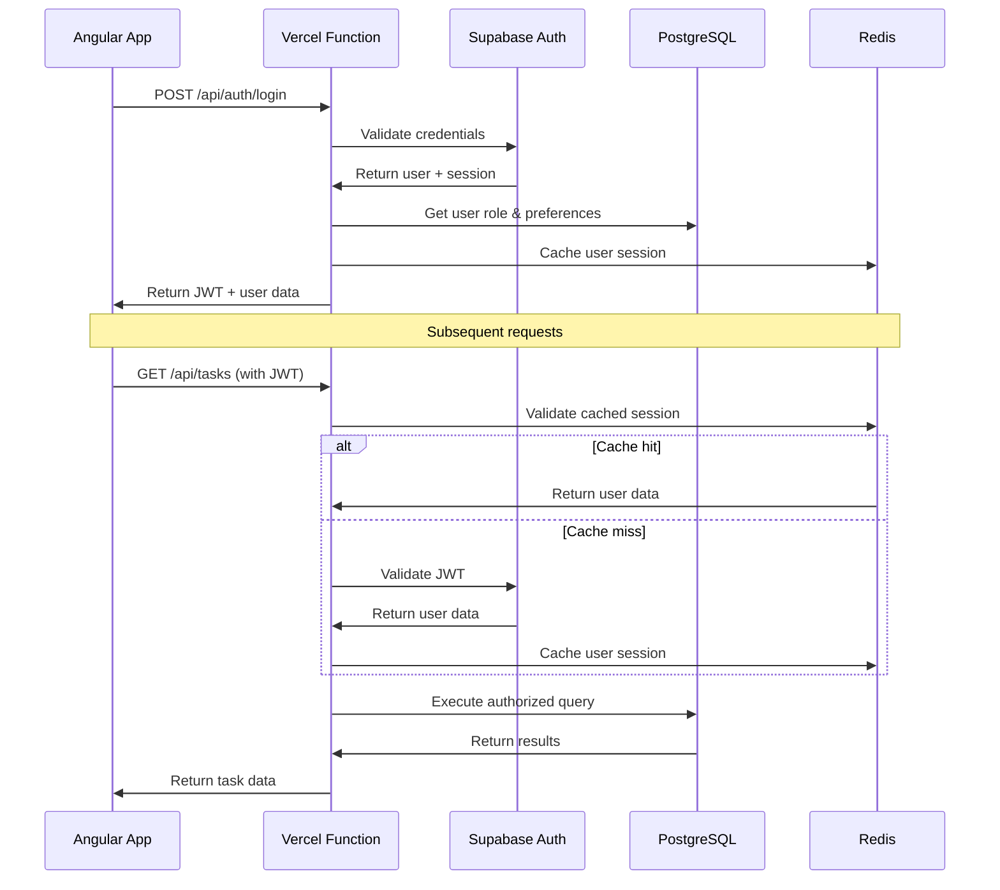

# Backend Architecture

Defining the Node.js/Express backend architecture optimized for the Vercel serverless platform while supporting sophisticated analytics processing and collaborative planning features. The architecture balances serverless efficiency with advanced technical demonstration capabilities.

### Service Architecture

#### Serverless Architecture (Chosen Platform: Vercel)

##### Function Organization

```text
api/
├── auth/
│   ├── login.ts                       # POST /api/auth/login
│   ├── register.ts                    # POST /api/auth/register
│   ├── refresh.ts                     # POST /api/auth/refresh
│   └── middleware/
│       └── auth-handler.ts            # JWT validation middleware
├── tasks/
│   ├── index.ts                       # GET /api/tasks (list with filtering)
│   ├── create.ts                      # POST /api/tasks
│   ├── [id]/
│   │   ├── index.ts                   # GET /api/tasks/[id]
│   │   ├── update.ts                  # PUT /api/tasks/[id]
│   │   ├── delete.ts                  # DELETE /api/tasks/[id]
│   │   └── status.ts                  # POST /api/tasks/[id]/status
│   └── bulk/
│       └── operations.ts              # POST /api/tasks/bulk
├── analytics/
│   ├── dashboard.ts                   # GET /api/analytics/dashboard
│   ├── behavioral-patterns.ts         # GET /api/analytics/behavioral-patterns
│   ├── completion-trends.ts           # GET /api/analytics/completion-trends
│   ├── export.ts                      # GET /api/analytics/export
│   └── real-time/
│       └── updates.ts                 # WebSocket handler for real-time updates
├── decisions/
│   ├── index.ts                       # GET /api/decisions (list with filtering)
│   ├── create.ts                      # POST /api/decisions
│   ├── [id]/
│   │   ├── index.ts                   # GET /api/decisions/[id]
│   │   ├── update.ts                  # PUT /api/decisions/[id]
│   │   ├── input.ts                   # POST /api/decisions/[id]/input
│   │   └── approve.ts                 # POST /api/decisions/[id]/approve
│   └── search.ts                      # GET /api/decisions/search
├── methodology/
│   ├── metrics.ts                     # GET /api/methodology/metrics
│   ├── collaboration-stats.ts         # GET /api/methodology/collaboration-stats
│   └── artifacts.ts                   # GET /api/methodology/artifacts
├── admin/
│   ├── health.ts                      # GET /api/admin/health
│   └── metrics.ts                     # GET /api/admin/metrics
└── shared/
    ├── database/
    │   ├── connection.ts              # PostgreSQL connection management
    │   ├── queries.ts                 # Optimized database queries
    │   └── migrations.ts              # Database schema management
    ├── services/
    │   ├── analytics-service.ts       # Analytics computation logic
    │   ├── notification-service.ts    # Real-time notifications
    │   └── cache-service.ts           # Redis caching layer
    ├── middleware/
    │   ├── cors.ts                    # CORS configuration
    │   ├── rate-limiting.ts           # Rate limiting for API protection
    │   ├── error-handler.ts           # Centralized error handling
    │   └── request-logger.ts          # Request logging for debugging
    └── utils/
        ├── validation.ts              # Input validation schemas
        ├── permissions.ts             # Role-based access control
        └── response-formatter.ts      # Consistent API responses
```

##### Function Template

```typescript
// Serverless function template with comprehensive error handling and performance optimization
import { VercelRequest, VercelResponse } from '@vercel/node';
import { z } from 'zod';
import { DatabaseService } from '../shared/database/connection';
import { authMiddleware } from '../shared/middleware/auth-handler';
import { corsMiddleware } from '../shared/middleware/cors';
import { rateLimitMiddleware } from '../shared/middleware/rate-limiting';
import { errorHandler } from '../shared/middleware/error-handler';
import { AnalyticsService } from '../shared/services/analytics-service';
import { CacheService } from '../shared/services/cache-service';

// Input validation schema for type safety and security
const DashboardQuerySchema = z.object({
  dateRange: z.coerce.number().min(1).max(365).default(30),
  userId: z.string().uuid().optional(),
  includePatterns: z.boolean().default(true)
});

// Main serverless function handler
export default async function handler(req: VercelRequest, res: VercelResponse) {
  try {
    // Apply middleware stack
    await corsMiddleware(req, res);
    await rateLimitMiddleware(req, res);
    await authMiddleware(req, res);

    if (req.method !== 'GET') {
      return res.status(405).json({
        error: {
          code: 'METHOD_NOT_ALLOWED',
          message: 'Only GET requests are allowed',
          timestamp: new Date().toISOString(),
          requestId: req.headers['x-request-id'] || 'unknown'
        }
      });
    }

    // Validate and parse query parameters
    const queryResult = DashboardQuerySchema.safeParse(req.query);
    if (!queryResult.success) {
      return res.status(400).json({
        error: {
          code: 'INVALID_PARAMETERS',
          message: 'Invalid query parameters',
          details: queryResult.error.issues,
          timestamp: new Date().toISOString(),
          requestId: req.headers['x-request-id'] || 'unknown'
        }
      });
    }

    const { dateRange, userId, includePatterns } = queryResult.data;
    const currentUserId = userId || req.user?.id;

    // Check cache first for performance during demonstrations
    const cacheKey = `dashboard:${currentUserId}:${dateRange}:${includePatterns}`;
    const cachedData = await CacheService.get(cacheKey);

    if (cachedData) {
      return res.status(200).json({
        data: cachedData,
        cached: true,
        timestamp: new Date().toISOString()
      });
    }

    // Initialize services
    const db = new DatabaseService();
    const analytics = new AnalyticsService(db);

    // Fetch dashboard analytics data
    const [taskStats, entryFrequency, completionTimes, behavioralPatterns] = await Promise.all([
      analytics.getTaskStatistics(currentUserId, dateRange),
      analytics.getEntryFrequencyData(currentUserId, dateRange),
      analytics.getCompletionTimeAnalysis(currentUserId, dateRange),
      includePatterns ? analytics.getBehavioralPatterns(currentUserId, dateRange) : null
    ]);

    const dashboardData = {
      taskStats,
      entryFrequency,
      completionTimes,
      behavioralPatterns,
      metadata: {
        dateRange,
        generatedAt: new Date().toISOString(),
        userId: currentUserId
      }
    };

    // Cache results for 5 minutes to improve presentation performance
    await CacheService.set(cacheKey, dashboardData, 300);

    // Return successful response
    res.status(200).json({
      data: dashboardData,
      cached: false,
      timestamp: new Date().toISOString()
    });

  } catch (error) {
    await errorHandler(error, req, res);
  }
}

// Export function configuration for Vercel
export const config = {
  api: {
    bodyParser: {
      sizeLimit: '1mb'
    },
    responseLimit: '8mb'
  }
};
```

### Database Architecture

#### Schema Design Integration

```typescript
// Database service with connection pooling and query optimization
import { Pool, PoolClient } from 'pg';
import { z } from 'zod';

export class DatabaseService {
  private static pool: Pool;

  constructor() {
    if (!DatabaseService.pool) {
      DatabaseService.pool = new Pool({
        connectionString: process.env.DATABASE_URL,
        ssl: process.env.NODE_ENV === 'production' ? { rejectUnauthorized: false } : false,
        max: 20, // Maximum connections
        idleTimeoutMillis: 30000,
        connectionTimeoutMillis: 2000
      });
    }
  }

  // Get database client with automatic connection management
  async getClient(): Promise<PoolClient> {
    return await DatabaseService.pool.connect();
  }

  // Execute query with performance monitoring
  async query<T>(text: string, params?: any[]): Promise<T[]> {
    const start = Date.now();
    const client = await this.getClient();

    try {
      const result = await client.query(text, params);
      const duration = Date.now() - start;

      // Log slow queries for optimization during development
      if (duration > 100) {
        console.warn(`Slow query detected (${duration}ms):`, text);
      }

      return result.rows;
    } finally {
      client.release();
    }
  }

  // Transaction support for complex operations
  async transaction<T>(callback: (client: PoolClient) => Promise<T>): Promise<T> {
    const client = await this.getClient();

    try {
      await client.query('BEGIN');
      const result = await callback(client);
      await client.query('COMMIT');
      return result;
    } catch (error) {
      await client.query('ROLLBACK');
      throw error;
    } finally {
      client.release();
    }
  }
}
```

#### Data Access Layer

```typescript
// Repository pattern implementation for clean data access
export class TaskRepository {
  constructor(private db: DatabaseService) {}

  // Get tasks with filtering and pagination
  async getTasks(
    userId: string,
    filters: TaskFilters = {},
    pagination: Pagination = { limit: 50, offset: 0 }
  ): Promise<{ tasks: Task[]; total: number }> {
    const { status, priority, tags, search } = filters;
    const { limit, offset } = pagination;

    let whereClause = 'WHERE user_id = $1';
    const params: any[] = [userId];
    let paramIndex = 2;

    // Build dynamic WHERE clause based on filters
    if (status) {
      whereClause += ` AND status = $${paramIndex}`;
      params.push(status);
      paramIndex++;
    }

    if (priority) {
      whereClause += ` AND priority = $${paramIndex}`;
      params.push(priority);
      paramIndex++;
    }

    if (tags && tags.length > 0) {
      whereClause += ` AND tags && $${paramIndex}`;
      params.push(tags);
      paramIndex++;
    }

    if (search) {
      whereClause += ` AND (title ILIKE $${paramIndex} OR description ILIKE $${paramIndex})`;
      params.push(`%${search}%`);
      paramIndex++;
    }

    // Execute count query for pagination
    const countQuery = `
      SELECT COUNT(*) as total
      FROM tasks
      ${whereClause}
    `;
    const countResult = await this.db.query<{ total: string }>(countQuery, params);
    const total = parseInt(countResult[0].total);

    // Execute main query with pagination
    const tasksQuery = `
      SELECT id, title, description, status, priority, user_id,
             created_at, updated_at, completed_at, estimated_minutes,
             actual_minutes, tags
      FROM tasks
      ${whereClause}
      ORDER BY created_at DESC
      LIMIT $${paramIndex} OFFSET $${paramIndex + 1}
    `;
    params.push(limit, offset);

    const tasks = await this.db.query<Task>(tasksQuery, params);

    return { tasks, total };
  }

  // Create task with automatic analytics tracking
  async createTask(taskData: CreateTaskRequest): Promise<Task> {
    return await this.db.transaction(async (client) => {
      // Insert task
      const taskQuery = `
        INSERT INTO tasks (title, description, user_id, estimated_minutes, priority, tags)
        VALUES ($1, $2, $3, $4, $5, $6)
        RETURNING *
      `;
      const taskResult = await client.query(taskQuery, [
        taskData.title,
        taskData.description,
        taskData.userId,
        taskData.estimatedMinutes,
        taskData.priority || 'medium',
        taskData.tags || []
      ]);

      const task = taskResult.rows[0];

      // Record initial status change for analytics
      const statusChangeQuery = `
        INSERT INTO status_changes (task_id, user_id, from_status, to_status, changed_at, context)
        VALUES ($1, $2, $3, $4, $5, $6)
      `;
      await client.query(statusChangeQuery, [
        task.id,
        taskData.userId,
        null,
        'not_started',
        new Date(),
        taskData.context || {}
      ]);

      return task;
    });
  }

  // Update task status with duration calculation
  async updateTaskStatus(
    taskId: string,
    userId: string,
    newStatus: TaskStatus,
    notes?: string,
    context?: any
  ): Promise<{ task: Task; statusChange: StatusChange }> {
    return await this.db.transaction(async (client) => {
      // Get current task state
      const currentTaskResult = await client.query(
        'SELECT * FROM tasks WHERE id = $1 AND user_id = $2',
        [taskId, userId]
      );

      if (currentTaskResult.rows.length === 0) {
        throw new Error('Task not found');
      }

      const currentTask = currentTaskResult.rows[0];

      // Calculate duration from last status change
      const lastStatusChangeResult = await client.query(
        'SELECT * FROM status_changes WHERE task_id = $1 ORDER BY changed_at DESC LIMIT 1',
        [taskId]
      );

      let durationMs: number | null = null;
      if (lastStatusChangeResult.rows.length > 0) {
        const lastChange = lastStatusChangeResult.rows[0];
        durationMs = Date.now() - new Date(lastChange.changed_at).getTime();
      }

      // Update task
      const updateTaskQuery = `
        UPDATE tasks
        SET status = $1,
            updated_at = NOW(),
            completed_at = CASE WHEN $1 = 'completed' THEN NOW() ELSE completed_at END
        WHERE id = $2 AND user_id = $3
        RETURNING *
      `;
      const updatedTaskResult = await client.query(updateTaskQuery, [
        newStatus,
        taskId,
        userId
      ]);

      // Insert status change record
      const statusChangeQuery = `
        INSERT INTO status_changes (task_id, user_id, from_status, to_status, changed_at, duration_ms, notes, context)
        VALUES ($1, $2, $3, $4, NOW(), $5, $6, $7)
        RETURNING *
      `;
      const statusChangeResult = await client.query(statusChangeQuery, [
        taskId,
        userId,
        currentTask.status,
        newStatus,
        durationMs,
        notes,
        context || {}
      ]);

      return {
        task: updatedTaskResult.rows[0],
        statusChange: statusChangeResult.rows[0]
      };
    });
  }
}
```

### Authentication and Authorization

#### Auth Flow Architecture



#### Middleware/Guards Implementation

```typescript
// Authentication middleware for serverless functions
import { VercelRequest, VercelResponse } from '@vercel/node';
import jwt from 'jsonwebtoken';
import { createClient } from '@supabase/supabase-js';

export interface AuthenticatedRequest extends VercelRequest {
  user?: {
    id: string;
    email: string;
    role: UserRole;
  };
}

export async function authMiddleware(
  req: AuthenticatedRequest,
  res: VercelResponse
): Promise<void> {
  const authHeader = req.headers.authorization;

  if (!authHeader || !authHeader.startsWith('Bearer ')) {
    res.status(401).json({
      error: {
        code: 'MISSING_TOKEN',
        message: 'Authorization header required',
        timestamp: new Date().toISOString()
      }
    });
    return;
  }

  const token = authHeader.substring(7);

  try {
    // Validate JWT with Supabase
    const supabase = createClient(
      process.env.SUPABASE_URL!,
      process.env.SUPABASE_ANON_KEY!
    );

    const { data: { user }, error } = await supabase.auth.getUser(token);

    if (error || !user) {
      res.status(401).json({
        error: {
          code: 'INVALID_TOKEN',
          message: 'Invalid or expired token',
          timestamp: new Date().toISOString()
        }
      });
      return;
    }

    // Get user role from database
    const db = new DatabaseService();
    const userResult = await db.query<{ id: string; role: UserRole }>(
      'SELECT id, role FROM users WHERE id = $1',
      [user.id]
    );

    if (userResult.length === 0) {
      res.status(401).json({
        error: {
          code: 'USER_NOT_FOUND',
          message: 'User not found in database',
          timestamp: new Date().toISOString()
        }
      });
      return;
    }

    // Attach user to request
    req.user = {
      id: user.id,
      email: user.email!,
      role: userResult[0].role
    };

  } catch (error) {
    res.status(401).json({
      error: {
        code: 'AUTH_ERROR',
        message: 'Authentication failed',
        timestamp: new Date().toISOString()
      }
    });
  }
}

// Role-based authorization decorator
export function requireRole(allowedRoles: UserRole[]) {
  return function(target: any, propertyName: string, descriptor: PropertyDescriptor) {
    const method = descriptor.value;

    descriptor.value = async function(req: AuthenticatedRequest, res: VercelResponse) {
      if (!req.user || !allowedRoles.includes(req.user.role)) {
        return res.status(403).json({
          error: {
            code: 'INSUFFICIENT_PERMISSIONS',
            message: 'Insufficient permissions for this operation',
            timestamp: new Date().toISOString()
          }
        });
      }

      return method.apply(this, arguments);
    };
  };
}
```

