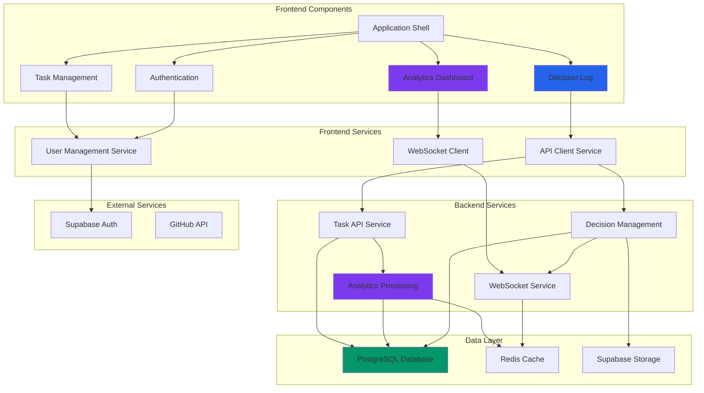

# Components

Based on the architectural patterns, tech stack, and data models defined above, I'll identify the major logical components/services across the fullstack that support both the task management functionality and BMad methodology demonstration requirements.

### Frontend Application Shell

**Responsibility:** Main Angular application container providing routing, authentication state management, and shared UI components for the BMad methodology demonstration interface.

**Key Interfaces:**
- Authentication service integration for user session management
- Global state management via NgRx for real-time analytics updates
- Responsive layout system supporting desktop and tablet presentation modes
- Navigation service providing context-aware routing for demonstration flows

**Dependencies:** Angular Router, NgRx Store, Angular Material, Authentication Service

**Technology Stack:** Angular 17+, NgRx, Angular Material, Tailwind CSS for professional stakeholder presentation quality

### Task Management Component

**Responsibility:** Comprehensive CRUD operations for tasks with enhanced status tracking, supporting both daily productivity use and behavioral analytics data capture.

**Key Interfaces:**
- Task API service for all CRUD operations and status changes
- Real-time status update notifications via WebSocket connections
- Analytics event emission for behavioral pattern tracking
- Bulk operations interface for efficient task management

**Dependencies:** Task API Service, WebSocket Service, Analytics Tracking Service

**Technology Stack:** Angular reactive forms, NgRx for state management, Angular Material components

### Analytics Dashboard Component

**Responsibility:** Real-time data visualization showcasing advanced technical capabilities through interactive charts, behavioral pattern displays, and productivity insights.

**Key Interfaces:**
- Analytics API service for dashboard data retrieval
- Chart rendering engine (Chart.js/D3.js) for professional visualizations
- Real-time data subscription service for live updates during demonstrations
- Export service for analytics data and chart images

**Dependencies:** Analytics API Service, Chart.js, WebSocket Service, Export Service

**Technology Stack:** Chart.js for consistent professional charts, NgRx for real-time state updates, Angular CDK for advanced UI patterns

### Decision Log Component

**Responsibility:** Collaborative decision documentation and stakeholder attribution interface, core to BMad methodology demonstration and transparency requirements.

**Key Interfaces:**
- Decision API service for CRUD operations and stakeholder input
- Collaborative input interface supporting threaded discussions
- Attribution display system showing stakeholder contributions
- Search and filtering service for decision archive management

**Dependencies:** Decision API Service, User Management Service, Notification Service

**Technology Stack:** Angular reactive forms, rich text editor for decision documentation, Angular Material for professional stakeholder presentation

### User Management Service

**Responsibility:** Authentication, authorization, and user profile management supporting role-based collaboration tracking and stakeholder attribution.

**Key Interfaces:**
- Supabase Auth integration for JWT token management
- Role-based permission system for collaboration features
- User preference management for dashboard customization
- Session management with automatic token refresh

**Dependencies:** Supabase Auth, JWT handling libraries, HTTP interceptors

**Technology Stack:** Supabase SDK, Angular HTTP interceptors, NgRx for authentication state

### Task API Service

**Responsibility:** Backend service providing task CRUD operations, status change tracking, and analytics data capture supporting both productivity features and behavioral analysis.

**Key Interfaces:**
- RESTful endpoints for standard task operations
- Status change endpoint with analytics context capture
- Bulk operations support for efficient data management
- Real-time event emission for WebSocket updates

**Dependencies:** PostgreSQL database, Express.js routing, Analytics Processing Service

**Technology Stack:** Node.js, Express.js, PostgreSQL with JSON analytics columns, Winston logging

### Analytics Processing Service

**Responsibility:** Background analytics computation, behavioral pattern recognition, and productivity insights generation showcasing advanced technical capabilities.

**Key Interfaces:**
- Task event processing for completion time analysis
- Behavioral pattern detection algorithms
- Dashboard data aggregation with caching optimization
- Real-time analytics update broadcasting via WebSocket

**Dependencies:** Task database, Redis caching, WebSocket service

**Technology Stack:** Node.js background workers, Redis for caching, PostgreSQL for analytics queries, statistical analysis libraries

### Decision Management Service

**Responsibility:** Collaborative decision logging, stakeholder input tracking, and methodology artifact generation supporting BMad demonstration transparency.

**Key Interfaces:**
- Decision CRUD operations with approval workflow
- Stakeholder input collection and attribution
- Decision search and categorization services
- Methodology metrics calculation for BMad effectiveness measurement

**Dependencies:** PostgreSQL database, User Management Service, Notification Service

**Technology Stack:** Node.js, Express.js, PostgreSQL with full-text search, email notification integration

### WebSocket Service

**Responsibility:** Real-time communication between frontend and backend enabling live analytics updates and collaborative planning notifications.

**Key Interfaces:**
- Real-time analytics data broadcasting for dashboard updates
- Collaborative decision notification system
- Task status change notifications for team coordination
- Connection management with authentication and reconnection logic

**Dependencies:** Authentication Service, Analytics Processing Service, Decision Management Service

**Technology Stack:** Socket.io for WebSocket management, Redis for scalable pub/sub messaging, JWT authentication integration

### Database Service

**Responsibility:** Data persistence, query optimization, and analytics data management supporting both transactional operations and complex analytics queries.

**Key Interfaces:**
- Task and user data persistence with ACID compliance
- Analytics query optimization for sub-100ms response times
- Decision log storage with full-text search capabilities
- Database migration and backup management

**Dependencies:** PostgreSQL database, connection pooling, migration tools

**Technology Stack:** PostgreSQL 15+, connection pooling (pg-pool), database migrations (Knex.js), JSON analytics columns

### Component Diagrams


