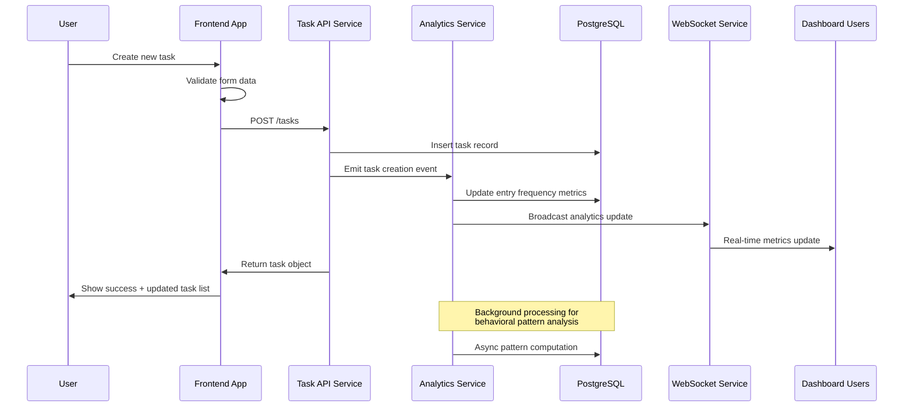
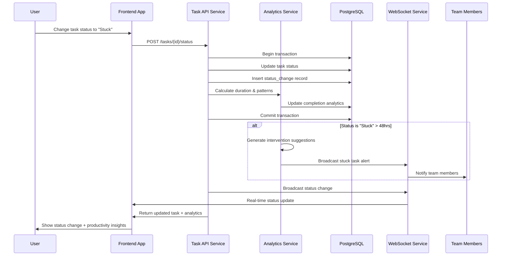
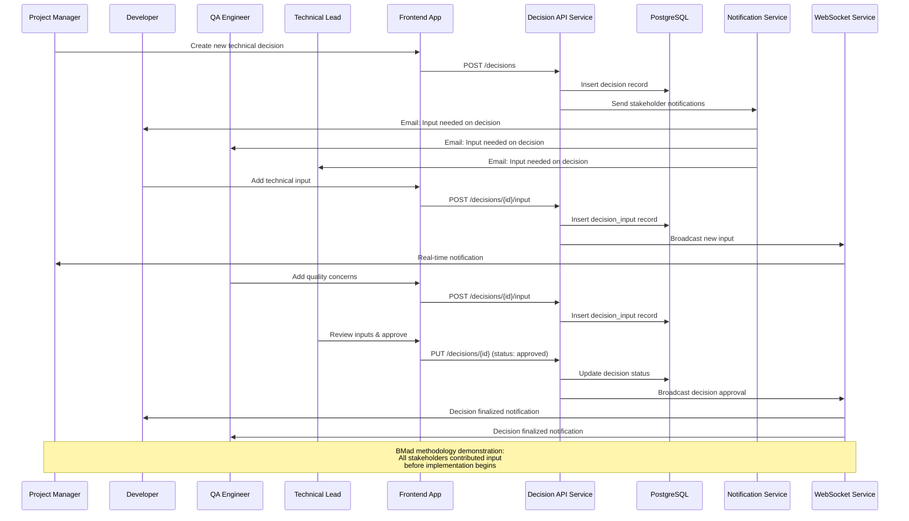
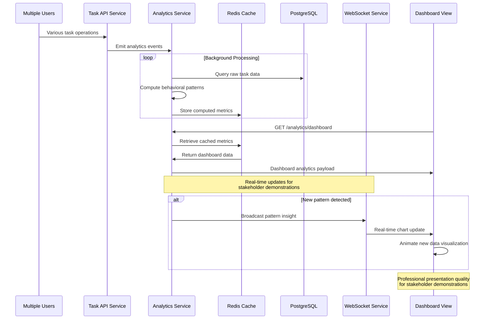
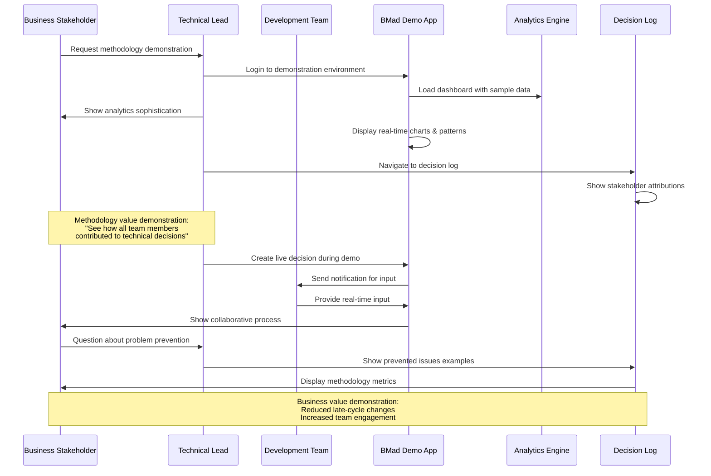

# Core Workflows

I'll illustrate the key system workflows using sequence diagrams that show both the technical architecture in action and the BMad methodology demonstration value. These workflows represent critical user journeys from the PRD that showcase collaborative planning benefits.

### Task Creation with Analytics Capture Workflow

### Enhanced Status Change with Real-time Analytics

### Collaborative Decision Creation Workflow

### Real-time Analytics Dashboard Update Workflow

### End-to-End BMad Methodology Demonstration Workflow


