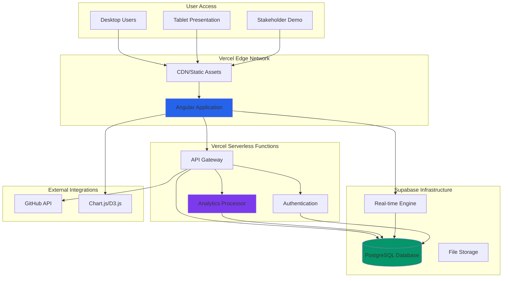

# High Level Architecture

### Technical Summary

This fullstack architecture implements a **monorepo-based collaborative planning showcase** featuring Angular frontend with Node.js/Express backend services, designed specifically for demonstrating advanced technical capabilities alongside the BMad methodology. The architecture emphasizes **real-time analytics integration** between frontend dashboard visualizations and backend behavioral analysis services, with **PostgreSQL providing robust analytics data management** and JSON flexibility for evolving metrics requirements.

Key integration points include **WebSocket connections for real-time chart updates**, **shared TypeScript interfaces ensuring type safety across the stack**, and **modular service architecture supporting Phase 2 ML extensions**. The system deploys to **cloud infrastructure with CI/CD automation**, positioning the technical implementation as both a functional productivity tool and a **stakeholder demonstration platform** showcasing development team sophistication and collaborative planning effectiveness.

The architecture achieves PRD goals by **balancing sophisticated analytics capabilities** (entry frequency tracking, completion time analysis, behavioral pattern recognition) with **transparent methodology documentation** (decision logs, stakeholder attribution, collaboration metrics), creating a unified system that impresses both technical and business stakeholders while providing meaningful productivity insights.

### Platform and Infrastructure Choice

Based on the PRD requirements and technical assumptions, I'm presenting **three viable platform options** for this BMad demonstration project:

**Option 1: Vercel + Supabase (Recommended)**
- **Pros:** Rapid deployment, built-in analytics, excellent Angular support, managed PostgreSQL, integrated auth
- **Cons:** Vendor lock-in, limited backend customization for advanced analytics
- **Fit:** Excellent for demonstration purposes, professional presentation quality

**Option 2: AWS Full Stack**
- **Pros:** Complete control, enterprise credibility, extensive analytics services (CloudWatch, Kinesis)
- **Cons:** Higher complexity, longer setup time, cost management overhead
- **Fit:** Strong for showcasing enterprise-level technical competency

**Option 3: Google Cloud Platform**
- **Pros:** Strong analytics/ML services for Phase 2, excellent PostgreSQL support, Cloud Run for containers
- **Cons:** Less Angular-specific tooling, steeper learning curve for team
- **Fit:** Best for long-term ML extensions but may be overkill for MVP

**Recommendation: Vercel + Supabase**
This combination provides the optimal balance for the BMad methodology demonstration: professional deployment quality that impresses stakeholders, rapid development velocity that supports collaborative planning timelines, and built-in analytics infrastructure that showcases technical sophistication without overwhelming the 2-3 week MVP timeline.

**Platform:** Vercel + Supabase
**Key Services:** Vercel (Angular hosting, serverless functions), Supabase (PostgreSQL, Auth, Real-time subscriptions), Vercel Analytics (performance monitoring)
**Deployment Host and Regions:** Vercel Edge Network (global), Supabase US-East (primary region for demonstration audiences)

### Repository Structure

For this BMad methodology demonstration, a **monorepo approach using npm workspaces** is the optimal choice:

**Rationale:** The collaborative planning methodology requires transparency and shared decision-making. A monorepo keeps all code, decisions, and artifacts in one location, supporting the BMad principle of visible thinking processes. Additionally, the Angular/Node.js tech stack benefits from shared TypeScript interfaces and unified tooling.

**Structure:** Monorepo with clear package boundaries
**Monorepo Tool:** npm workspaces (lightweight, no additional tooling complexity)
**Package Organization:**
- `apps/simple-todo` (Angular frontend)
- `apps/simple-todo-backend` (Node.js/Express backend)
- `packages/shared` (TypeScript interfaces, utilities)
- `packages/ui` (shared Angular components)

### High Level Architecture Diagram

### Architectural Patterns

Based on the BMad methodology requirements and technical sophistication goals, these patterns will guide development:

- **Jamstack Architecture:** Static Angular build with serverless API functions - *Rationale:* Optimal performance for stakeholder presentations and scalable analytics processing
- **Component-Based UI:** Reusable Angular components with Angular Material - *Rationale:* Professional presentation quality and maintainable codebase for collaborative development
- **Repository Pattern:** Abstract data access logic with TypeScript interfaces - *Rationale:* Enables testing and supports Phase 2 ML feature extensions
- **Real-time Observer Pattern:** WebSocket subscriptions for live analytics - *Rationale:* Showcases technical sophistication through live dashboard updates
- **Command Query Responsibility Segregation (CQRS):** Separate read/write models for analytics - *Rationale:* Optimizes analytics queries while maintaining transaction integrity
- **API Gateway Pattern:** Centralized routing through Vercel functions - *Rationale:* Unified authentication, rate limiting, and monitoring for demonstration reliability

