# Information Architecture (IA)

### Site Map / Screen Inventory

```mermaid
graph TD
    A[Login/Authentication] --> B[Main Dashboard]
    B --> C[Task Management]
    B --> D[Analytics Hub]
    B --> E[Decision Log]
    B --> F[Methodology Center]

    C --> C1[Task List View]
    C --> C2[Task Creation/Edit]
    C --> C3[Status Workflow]
    C --> C4[Task Search/Filter]

    D --> D1[Entry Frequency Analytics]
    D --> D2[Completion Time Analysis]
    D --> D3[Behavioral Patterns]
    D --> D4[Productivity Insights]
    D --> D5[Real-time Charts]

    E --> E1[All Decisions View]
    E --> E2[Decision Creation]
    E --> E3[Stakeholder Attribution]
    E --> E4[Decision Categories]
    E --> E5[Decision Search]

    F --> F1[BMad Process Documentation]
    F --> F2[Collaboration Metrics]
    F --> F3[Success Measurement]
    F --> F4[Methodology Artifacts]

    B --> G[User Profile]
    G --> G1[Account Settings]
    G --> G2[Notification Preferences]
    G --> G3[Role Management]
```

### Navigation Structure

**Primary Navigation:** Top-level horizontal navigation featuring five main areas:
- **Dashboard** (landing page - analytics overview + recent activity)
- **Tasks** (core CRUD functionality with enhanced status tracking)
- **Analytics** (dedicated analytics hub showcasing technical capabilities)
- **Decisions** (collaborative planning transparency center)
- **Methodology** (BMad process documentation and success metrics)

**Secondary Navigation:** Context-sensitive sidebar navigation within each main section:
- Tasks: Status-based filtering, search, bulk operations
- Analytics: Time period selection, chart type switching, data export
- Decisions: Category filtering, stakeholder filtering, chronological/thematic views
- Methodology: Process phases, success metrics, team collaboration tools

**Breadcrumb Strategy:** Hierarchical breadcrumbs for deep-dive sections (Analytics → Behavioral Patterns → Specific Analysis) with quick navigation back to main dashboard for demonstration flow management.

