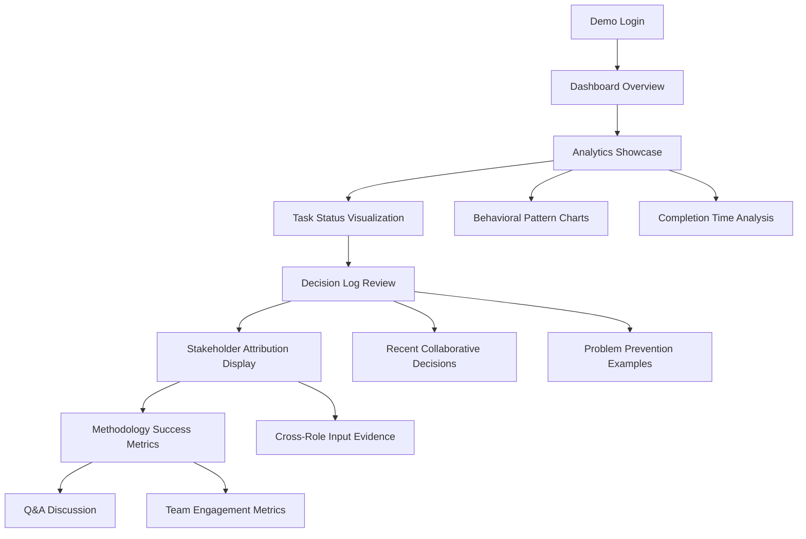
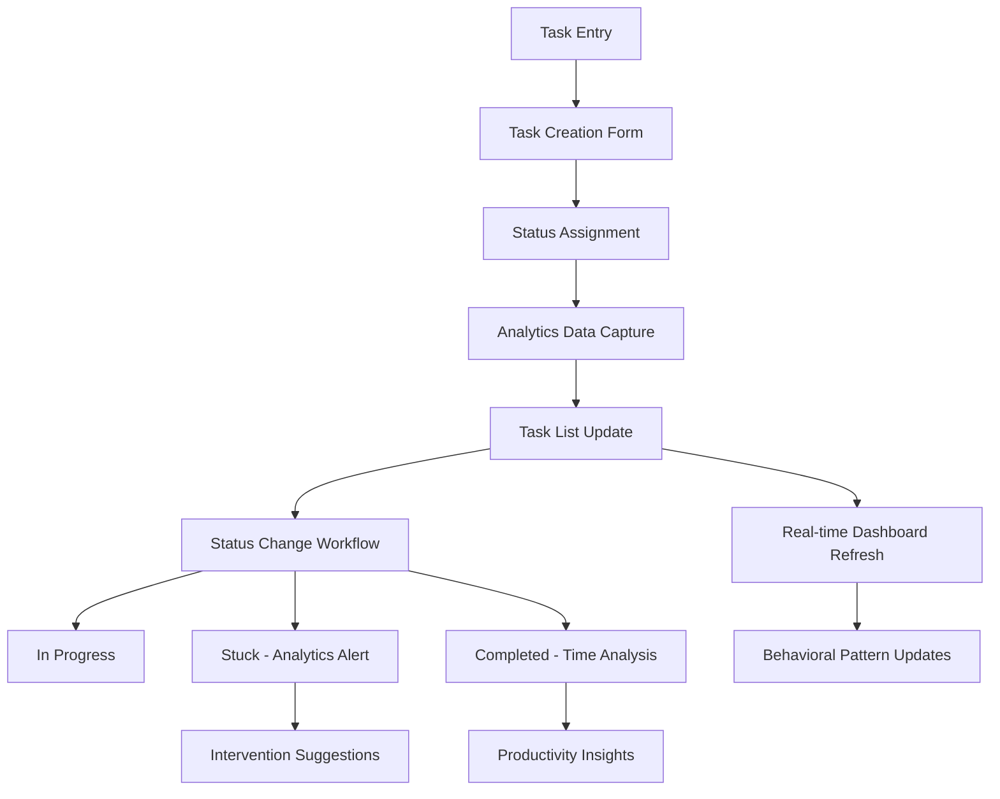
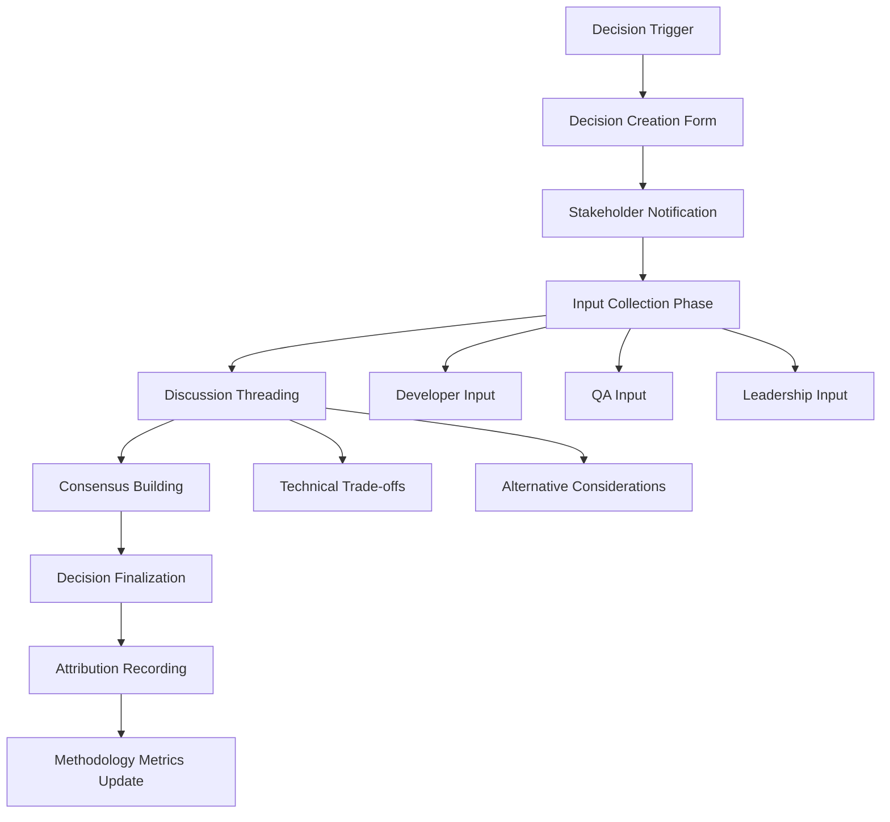

# User Flows

### Flow 1: Stakeholder Demonstration Journey

**User Goal:** Technical leadership demonstrates BMad methodology value and technical sophistication to business stakeholders

**Entry Points:** Login screen during scheduled demonstration, direct dashboard link for presentation mode

**Success Criteria:** Business stakeholders understand methodology benefits and express confidence in technical team capabilities within 15-minute demo

#### Flow Diagram

#### Edge Cases & Error Handling:
- **No recent activity:** Show historical data examples or simulated demonstration data
- **Technical questions beyond demo scope:** Redirect to detailed methodology documentation
- **Stakeholder requests specific metrics:** Quick navigation to relevant analytics sections
- **Demo time constraints:** Streamlined "highlight reel" mode focusing on key methodology benefits

### Flow 2: Daily Task Management with Analytics Integration

**User Goal:** User manages tasks efficiently while system captures behavioral data for productivity insights

**Entry Points:** Dashboard after login, direct task list access, quick-add from any screen

**Success Criteria:** Task operations completed efficiently with immediate analytics feedback and status progression clarity

#### Flow Diagram

#### Edge Cases & Error Handling:
- **Stuck status extended duration:** Automatic intervention suggestions and productivity coaching
- **Rapid status changes:** Validation to prevent accidental status updates
- **Bulk task operations:** Confirmation dialogs and undo functionality
- **Analytics processing delays:** Loading states and fallback to cached data

### Flow 3: Collaborative Decision Documentation

**User Goal:** Technical team members document decisions with stakeholder input and transparent rationale

**Entry Points:** Decision log section, decision prompts during development workflow, cross-references from task discussions

**Success Criteria:** Technical decisions captured with full stakeholder attribution and accessible rationale for future reference

#### Flow Diagram

#### Edge Cases & Error Handling:
- **Stakeholder non-participation:** Escalation notifications and deadline management
- **Conflicting stakeholder input:** Structured conflict resolution workflow
- **Decision revision requirements:** Version control and change impact assessment
- **Missing stakeholder roles:** Role assignment and participation tracking

