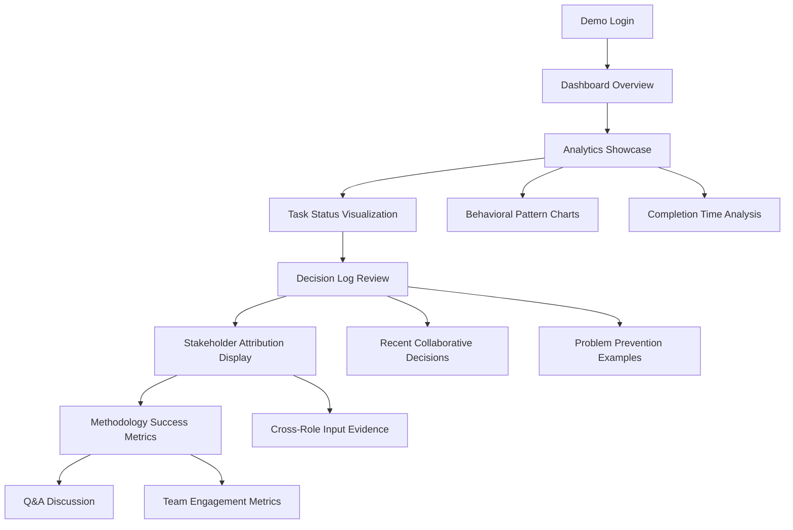
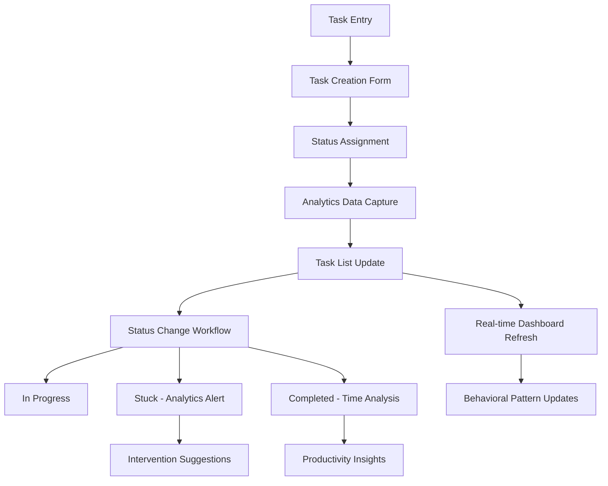
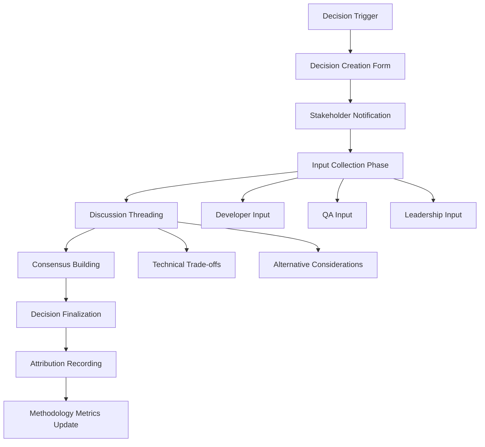

# BMad Demonstration To-Do App UI/UX Specification

## Introduction

This document defines the user experience goals, information architecture, user flows, and visual design specifications for BMad Demonstration To-Do App's user interface. It serves as the foundation for visual design and frontend development, ensuring a cohesive and user-centered experience.

### Change Log

| Date | Version | Description | Author |
|------|---------|-------------|---------|
| 2025-09-15 | 1.0 | Initial UI/UX specification creation | Sally (UX Expert) |

## Overall UX Goals & Principles

### Target User Personas

**Primary Persona - Technical Leadership (Directors/VPs of Engineering):**
- 7-15 years experience, managing 3-8 teams
- Frustrated with current Scrum dysfunction, seeking both process improvements and team engagement
- Need to demonstrate technical competency to business stakeholders
- Want to rekindle joy in technical work through meaningful collaboration

**Secondary Persona - Development Team Members (Developers & QA):**
- 2-10 years experience, currently excluded from early requirements collaboration
- Range from skeptical senior developers to QA engineers seeking quality partnership
- Want meaningful input in technical solution design and authentic learning opportunities
- Need ownership and creative input in solutions they implement

**Tertiary Persona - Business Stakeholders:**
- Need to evaluate methodology effectiveness and technical team capabilities
- Want confidence in both planning approach and delivery outcomes
- Require clear visibility into development progress and decision-making

### Usability Goals

1. **Methodology Transparency:** Stakeholders can understand collaborative planning value within 5 minutes of demo
2. **Technical Sophistication Display:** Advanced features are prominently visible and impressive to technical audiences
3. **Effortless Analytics Access:** Users can access meaningful productivity insights with zero learning curve
4. **Collaborative Decision Visibility:** All stakeholders can see and understand their contributions to project decisions
5. **Professional Demonstration Ready:** Interface impresses business stakeholders during methodology presentations

### Design Principles

1. **Showcase Over Simplicity:** Unlike typical apps that hide complexity, prominently display technical sophistication to demonstrate team capabilities
2. **Transparency as Feature:** Make collaborative planning processes visible and central to the experience, not hidden
3. **Dual-Audience Design:** Serve both daily users AND demonstration audiences with equal priority
4. **Data-Driven Confidence:** Use analytics and metrics prominently to build stakeholder confidence in both app and methodology
5. **Methodology Integration:** Every interface element should either support task management OR demonstrate collaborative planning value

## Information Architecture (IA)

### Site Map / Screen Inventory

```mermaid
graph TD
    A[Login/Authentication] --> B[Main Dashboard]
    B --> C[Task Management]
    B --> D[Analytics Hub]
    B --> E[Decision Log]
    B --> F[Methodology Center]

    C --> C1[Task List View]
    C --> C2[Task Creation/Edit]
    C --> C3[Status Workflow]
    C --> C4[Task Search/Filter]

    D --> D1[Entry Frequency Analytics]
    D --> D2[Completion Time Analysis]
    D --> D3[Behavioral Patterns]
    D --> D4[Productivity Insights]
    D --> D5[Real-time Charts]

    E --> E1[All Decisions View]
    E --> E2[Decision Creation]
    E --> E3[Stakeholder Attribution]
    E --> E4[Decision Categories]
    E --> E5[Decision Search]

    F --> F1[BMad Process Documentation]
    F --> F2[Collaboration Metrics]
    F --> F3[Success Measurement]
    F --> F4[Methodology Artifacts]

    B --> G[User Profile]
    G --> G1[Account Settings]
    G --> G2[Notification Preferences]
    G --> G3[Role Management]
```

### Navigation Structure

**Primary Navigation:** Top-level horizontal navigation featuring five main areas:
- **Dashboard** (landing page - analytics overview + recent activity)
- **Tasks** (core CRUD functionality with enhanced status tracking)
- **Analytics** (dedicated analytics hub showcasing technical capabilities)
- **Decisions** (collaborative planning transparency center)
- **Methodology** (BMad process documentation and success metrics)

**Secondary Navigation:** Context-sensitive sidebar navigation within each main section:
- Tasks: Status-based filtering, search, bulk operations
- Analytics: Time period selection, chart type switching, data export
- Decisions: Category filtering, stakeholder filtering, chronological/thematic views
- Methodology: Process phases, success metrics, team collaboration tools

**Breadcrumb Strategy:** Hierarchical breadcrumbs for deep-dive sections (Analytics → Behavioral Patterns → Specific Analysis) with quick navigation back to main dashboard for demonstration flow management.

## User Flows

### Flow 1: Stakeholder Demonstration Journey

**User Goal:** Technical leadership demonstrates BMad methodology value and technical sophistication to business stakeholders

**Entry Points:** Login screen during scheduled demonstration, direct dashboard link for presentation mode

**Success Criteria:** Business stakeholders understand methodology benefits and express confidence in technical team capabilities within 15-minute demo

#### Flow Diagram

#### Edge Cases & Error Handling:
- **No recent activity:** Show historical data examples or simulated demonstration data
- **Technical questions beyond demo scope:** Redirect to detailed methodology documentation
- **Stakeholder requests specific metrics:** Quick navigation to relevant analytics sections
- **Demo time constraints:** Streamlined "highlight reel" mode focusing on key methodology benefits

### Flow 2: Daily Task Management with Analytics Integration

**User Goal:** User manages tasks efficiently while system captures behavioral data for productivity insights

**Entry Points:** Dashboard after login, direct task list access, quick-add from any screen

**Success Criteria:** Task operations completed efficiently with immediate analytics feedback and status progression clarity

#### Flow Diagram

#### Edge Cases & Error Handling:
- **Stuck status extended duration:** Automatic intervention suggestions and productivity coaching
- **Rapid status changes:** Validation to prevent accidental status updates
- **Bulk task operations:** Confirmation dialogs and undo functionality
- **Analytics processing delays:** Loading states and fallback to cached data

### Flow 3: Collaborative Decision Documentation

**User Goal:** Technical team members document decisions with stakeholder input and transparent rationale

**Entry Points:** Decision log section, decision prompts during development workflow, cross-references from task discussions

**Success Criteria:** Technical decisions captured with full stakeholder attribution and accessible rationale for future reference

#### Flow Diagram

#### Edge Cases & Error Handling:
- **Stakeholder non-participation:** Escalation notifications and deadline management
- **Conflicting stakeholder input:** Structured conflict resolution workflow
- **Decision revision requirements:** Version control and change impact assessment
- **Missing stakeholder roles:** Role assignment and participation tracking

## Wireframes & Mockups

**Primary Design Files:** Figma for collaborative design work, allowing the entire technical team to access, comment on, and iterate on designs as part of the BMad methodology demonstration.

### Key Screen Layouts

#### Dashboard Analytics Hub
**Purpose:** Primary landing screen showcasing technical sophistication through comprehensive analytics while providing quick access to all major functions

**Key Elements:**
- Real-time analytics cards displaying entry frequency, completion trends, and behavioral patterns
- Interactive charts (line graphs for trends, heat maps for patterns, pie charts for status distribution)
- Recent collaborative decisions panel with stakeholder attribution badges
- Quick task creation widget with enhanced status options
- Methodology success metrics sidebar showing BMad approach benefits
- Navigation hub with clear paths to all major sections

**Interaction Notes:** Dashboard must work for both daily users (quick task access) and demonstration audiences (impressive visual analytics). Charts should be interactive with drill-down capabilities and real-time updates.

#### Decision Log & Collaboration Interface
**Purpose:** Showcase transparent collaborative planning with full stakeholder attribution and decision rationale

**Key Elements:**
- Decision timeline with chronological and categorical organization
- Stakeholder contribution badges showing Developer/QA/Leadership input
- Decision detail cards with rationale, alternatives considered, and implementation status
- Collaborative discussion threads with role-based color coding
- Impact tracking showing prevented issues and methodology benefits
- Search and filtering by decision type, stakeholder, or project phase

**Interaction Notes:** Interface must demonstrate methodology value clearly to business stakeholders while remaining functional for daily development team use. Attribution should be prominent and trustworthy.

#### Task Management with Analytics Integration
**Purpose:** Familiar task management enhanced with sophisticated status tracking and immediate analytics feedback

**Key Elements:**
- Enhanced status workflow with visual progression (Not Started → In Progress → Stuck → Completed)
- Real-time productivity insights showing completion patterns and time estimates
- Smart task suggestions based on behavioral analytics
- Bulk operations with confirmation dialogs and undo functionality
- Analytics sidebar displaying relevant productivity metrics and patterns
- Search and filtering with saved views and custom criteria

**Interaction Notes:** Balance productivity efficiency with analytics sophistication. Status changes should feel immediate and provide valuable feedback without disrupting workflow.

## Component Library / Design System

**Design System Approach:** Hybrid approach combining Angular Material as foundation with custom components for advanced analytics and methodology demonstration features.

### Core Components

#### Analytics Visualization Components
**Purpose:** Showcase technical sophistication through interactive data visualization components

**Variants:** Real-time Line Charts, Interactive Heat Maps, Status Flow Diagrams, Metric Cards

**States:** Loading, populated, empty data, error, interactive hover, keyboard focus

**Usage Guidelines:** Analytics components must work for both daily productivity insights AND impressive stakeholder demonstrations with accessibility-first design.

#### Collaborative Decision Components
**Purpose:** Demonstrate BMad methodology value through transparent decision documentation

**Variants:** Decision Cards, Attribution Badges, Discussion Threads, Timeline Views

**States:** Draft, under discussion, approved, implemented, archived, with notification states

**Usage Guidelines:** Unique differentiators showcasing collaborative planning value with emphasis on transparency and professional credibility.

#### Enhanced Task Management Components
**Purpose:** Familiar task management enhanced with sophisticated status tracking

**Variants:** Status Progression Indicators, Smart Task Cards, Bulk Action Controls, Search and Filter Components

**States:** Standard CRUD states plus analytics-enhanced states

**Usage Guidelines:** Balance familiar productivity patterns with sophisticated analytics features.

## Branding & Style Guide

### Visual Identity
**Brand Guidelines:** Professional technical competency emphasis supporting both daily productivity use and stakeholder presentation quality.

### Color Palette

| Color Type | Hex Code | Usage |
|------------|----------|--------|
| Primary | #2563EB | Analytics highlights, CTA buttons, technical sophistication emphasis |
| Secondary | #7C3AED | Methodology elements, collaborative planning features, BMad branding |
| Accent | #059669 | Success states, completed tasks, positive metrics |
| Success | #10B981 | Positive feedback, confirmations, productivity achievements |
| Warning | #F59E0B | Cautions, stuck tasks, attention-required states |
| Error | #EF4444 | Errors, destructive actions, critical alerts |
| Neutral | #64748B, #F8FAFC, #E2E8F0 | Text hierarchy, borders, backgrounds |

### Typography

#### Font Families
- **Primary:** Inter (clean, professional, excellent readability for analytics)
- **Secondary:** JetBrains Mono (code elements, technical credibility)
- **Monospace:** Fira Code (development artifacts, decision logs)

#### Type Scale

| Element | Size | Weight | Line Height |
|---------|------|--------|-------------|
| H1 | 36px | 700 | 1.2 |
| H2 | 30px | 600 | 1.3 |
| H3 | 24px | 600 | 1.4 |
| Body | 16px | 400 | 1.6 |
| Small | 14px | 400 | 1.5 |

### Iconography
**Icon Library:** Heroicons (consistent with Angular Material, professional appearance)

**Usage Guidelines:** Icons emphasize clarity and professional competency with sophisticated analytics and collaboration emphasis.

### Spacing & Layout
**Grid System:** 8-point grid system for consistent spacing and professional layout alignment

**Spacing Scale:** 4px, 8px, 16px, 24px, 32px, 48px, 64px base increments

## Accessibility Requirements

### Compliance Target
**Standard:** WCAG 2.1 AA compliance with selective AAA features for demonstration excellence

### Key Requirements

**Visual:**
- Color contrast ratios: Minimum 4.5:1 for normal text, 3:1 for large text
- Focus indicators: Clear, consistent focus outlines (2px solid, high contrast)
- Text sizing: All content remains functional and readable when zoomed to 200%

**Interaction:**
- Keyboard navigation: Complete application functionality accessible via keyboard
- Screen reader support: Comprehensive ARIA labeling, semantic HTML structure
- Touch targets: Minimum 44x44px touch targets for all interactive elements

**Content:**
- Alternative text: Descriptive alt text for all images, data table alternatives for charts
- Heading structure: Logical H1-H6 hierarchy enabling efficient screen reader navigation
- Form labels: Explicit label association, clear error messages, helpful input guidance

### Testing Strategy
- **Automated Testing:** axe-core integration, Lighthouse accessibility audits, Pa11y testing
- **Manual Testing:** Keyboard-only navigation, screen reader testing, color blindness simulation, zoom testing
- **User Testing:** Real user validation with assistive technology users

## Responsiveness Strategy

### Breakpoints

| Breakpoint | Min Width | Max Width | Target Devices |
|------------|-----------|-----------|----------------|
| Mobile | 320px | 767px | Smartphones, emergency access |
| Tablet | 768px | 1023px | iPads, presentation tablets, meeting rooms |
| Desktop | 1024px | 1439px | Standard laptops, development workstations |
| Wide | 1440px | - | Large monitors, presentation displays, conference rooms |

### Adaptation Patterns

**Layout Changes:**
- **Desktop/Wide:** Three-column layout with analytics sidebar, main content, methodology panel
- **Tablet:** Two-column layout prioritizing analytics dashboard and task management
- **Mobile:** Single-column stack with bottom navigation

**Navigation Changes:**
- **Desktop/Wide:** Full horizontal navigation with secondary sidebar navigation
- **Tablet:** Horizontal navigation with slide-out panels
- **Mobile:** Bottom tab navigation with hamburger menu for secondary features

**Content Priority:**
- **Wide screens:** Full analytics showcase with comprehensive decision logs and methodology documentation
- **Desktop:** Balanced view emphasizing both productivity and analytics
- **Tablet:** Analytics-first approach for presentation scenarios
- **Mobile:** Task management priority with quick analytics access

## Animation & Micro-interactions

### Motion Principles
**Professional Sophistication Over Playfulness:** Motion design emphasizes technical competency and smooth user experience. Performance-first approach with 60fps optimization and reduced motion respect.

### Key Animations
- **Dashboard Analytics Transitions:** Smooth chart updates (300ms, ease-out)
- **Task Status Progression:** Visual confirmation with subtle celebration (200ms, ease-in-out)
- **Decision Log Reveals:** Elegant expansion with stakeholder attribution highlights (250ms)
- **Collaboration Notifications:** Gentle attention-drawing for new stakeholder input (400ms)
- **Loading State Sophistication:** Professional skeleton screens and progress indicators
- **Chart Interaction Feedback:** Hover and selection states (150ms, ease-out)
- **Navigation Transitions:** Smooth page transitions maintaining context (200ms)
- **Form Validation Animations:** Clear, helpful error state animations (300ms)

## Performance Considerations

### Performance Goals
- **Page Load:** Under 2 seconds for initial dashboard load including basic analytics
- **Interaction Response:** Sub-100ms response times for all user interactions
- **Animation FPS:** Consistent 60fps for all animations and chart interactions

### Design Strategies
- **Analytics Performance Optimization:** Progressive loading, efficient data visualization, caching strategy, background processing
- **Image and Asset Optimization:** Compressed images, minified CSS/JS, efficient font loading
- **Code Splitting and Lazy Loading:** Route-based code splitting, component-level lazy loading, predictive preloading

## Next Steps

### Immediate Actions
1. **Conduct stakeholder review session** with technical leadership and development team
2. **Create Figma design files** implementing wireframes, component library, and style guide
3. **Schedule BMad methodology planning session** for collaborative design of decision logging features
4. **Establish design-to-development handoff process** ensuring Angular implementation maintains design integrity
5. **Validate responsive design approach** by testing on actual presentation devices

### Design Handoff Checklist
- [x] All user flows documented and validated with stakeholders
- [x] Component inventory complete with accessibility annotations
- [x] Accessibility requirements defined with WCAG AA compliance standards
- [x] Responsive strategy clear with device-specific adaptation patterns
- [x] Brand guidelines incorporated with professional stakeholder presentation standards
- [x] Performance goals established with specific metrics for analytics and collaboration features

---

*UI/UX Specification completed using the BMAD-METHOD™ collaborative planning framework*